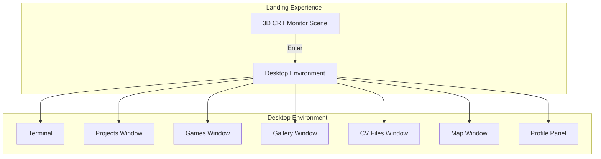

# Portfolio Documentation Index

> **Bogi's Portfolio** — A neobrutalist vaporwave portfolio built with Next.js, React Three Fiber, and TypeScript.



## 📋 Documentation Structure

This documentation is organized into **phases** that roughly correspond to the development order, plus **technology deep dives** for detailed explanations of the key technologies used.

---

## 🚀 Phases

### Phase 1: Project Setup & Foundation
| Document | Description |
|----------|-------------|
| [[01 - Project Initialization\|01 - Project Initialization]] | Creating the Next.js project with TypeScript, initial configuration |
| [[02 - Core Configuration\|02 - Core Configuration]] | Next.js config, TypeScript setup, Tailwind CSS configuration |

### Phase 2: Core Architecture
| Document | Description |
|----------|-------------|
| [[03 - Project Structure\|03 - Project Structure]] | Folder organization, file naming conventions |
| [[04 - State Management\|04 - State Management]] | Zustand store for global state (power state, screen glow, avatar) |
| [[05 - Routing & Navigation\|05 - Routing & Navigation]] | App Router structure, page transitions |

### Phase 3: 3D Experience
| Document | Description |
|----------|-------------|
| [[06 - React Three Fiber Setup\|06 - React Three Fiber Setup]] | 3D scene architecture, Canvas configuration |
| [[07 - The CRT Monitor Model\|07 - The CRT Monitor Model]] | FBX model loading, screen effects, camera animation |
| [[08 - Scene Effects\|08 - Scene Effects]] | Stars, particles, lighting, floating animation |

### Phase 4: Desktop Environment
| Document | Description |
|----------|-------------|
| [[09 - Desktop Architecture\|09 - Desktop Architecture]] | Main desktop page structure, background effects |
| [[10 - Window Management System\|10 - Window Management System]] | Draggable windows, z-index management, open/close/toggle |
| [[11 - Terminal Implementation\|11 - Terminal Implementation]] | Custom terminal hook, command parsing, easter eggs |
| [[12 - Desktop Components\|12 - Desktop Components]] | Games, Projects, Gallery, CV, Map windows |
| [[13 - Styling Architecture\|13 - Styling Architecture]] | SCSS modules, CSS files, neobrutalist design system |

### Phase 5: Data & Content
| Document | Description |
|----------|-------------|
| [[14 - Data Architecture\|14 - Data Architecture]] | Centralized data in constants, TypeScript interfaces |
| [[15 - Interactive Features\|15 - Interactive Features]] | GitHub calendar, music player, avatar animations |
| [[16 - Training Window\|16 - Training Window]] | Ausbildung departments and tasks window |

---

## 🛠️ Technology Deep Dives

These files provide detailed explanations of the core technologies and how they fit into the project:

| Technology | File | Description |
|------------|------|-------------|
| [[TECH - Next.js\|TECH - Next.js]] | App Router, SSR/CSR, dynamic imports, routing |
| [[TECH - React & TypeScript\|TECH - React & TypeScript]] | Hooks, components, type safety |
| [[TECH - React Three Fiber\|TECH - React Three Fiber]] | 3D rendering in React, scene graph, hooks |
| [[TECH - Zustand\|TECH - Zustand]] | Lightweight state management |
| [[TECH - Tailwind CSS\|TECH - Tailwind CSS]] | Utility-first CSS framework |
| [[TECH - Three.js\|TECH - Three.js]] | Core 3D library concepts |

---

## 🎯 Quick Reference

### File Structure Overview
```
src/
├── app/                    # Next.js App Router pages
│   ├── page.tsx           # Landing (3D monitor)
│   ├── desktop/page.tsx   # Desktop environment
│   └── xp/page.tsx        # XP page (placeholder)
├── components/
│   ├── 3d/                # Three.js components
│   ├── desktop/           # Desktop UI components
│   └── ui/                # Shared UI components
├── hooks/                 # Custom React hooks
├── store/                 # Zustand stores
├── constants/             # Data and types
├── styles/                # SCSS and CSS files
└── types/                 # TypeScript type definitions
```

### Key Commands
```bash
npm run dev      # Start development server
npm run build    # Build for production
npm run lint     # Run ESLint
```

### Tech Stack Summary
- **Framework**: [Next.js 16](https://nextjs.org/) — [[TECH - Next.js\|TECH - Next.js]]
- **UI Library**: [React 19](https://react.dev/) — [[TECH - React & TypeScript\|TECH - React & TypeScript]]
- **Language**: [TypeScript 5](https://www.typescriptlang.org/)
- **3D**: [React Three Fiber](https://docs.pmnd.rs/react-three-fiber) + [Three.js](https://threejs.org/) — [[TECH - React Three Fiber\|TECH - React Three Fiber]], [[TECH - Three.js\|TECH - Three.js]]
- **State**: [Zustand](https://github.com/pmndrs/zustand) — [[TECH - Zustand\|TECH - Zustand]]
- **Styling**: [Tailwind CSS 4](https://tailwindcss.com/) + SCSS — [[TECH - Tailwind CSS\|TECH - Tailwind CSS]]

---

## 📝 Notes for Obsidian Users

> [!tip] Obsidian Tips
> - Use `[[File Name]]` syntax to link between notes
> - Graph view shows relationships between documentation files
> - Mermaid diagrams render automatically
> - Code blocks have syntax highlighting

---

*Last updated: 2026-02-27*
