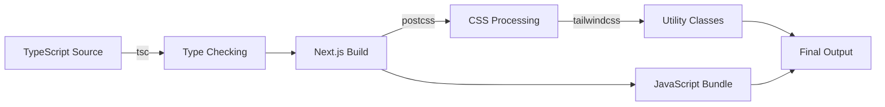

# Phase 1: Core Configuration

> Configuration files that define how the project builds, types are checked, and styles are processed.

---

## 🎯 What Was Done

After project initialization, the default configuration files were customized to fit the portfolio's specific needs. This includes TypeScript paths, Next.js output settings, and styling pipeline configuration.

---

## 📁 Configuration Files

### 1. TypeScript Configuration (`tsconfig.json`)

The TypeScript configuration enables modern JavaScript features and sets up path aliases for cleaner imports.

```json
{
  "compilerOptions": {
    "target": "ES2017",
    "lib": ["dom", "dom.iterable", "esnext"],
    "allowJs": true,
    "skipLibCheck": true,
    "strict": true,
    "noEmit": true,
    "esModuleInterop": true,
    "module": "esnext",
    "moduleResolution": "bundler",
    "resolveJsonModule": true,
    "isolatedModules": true,
    "jsx": "react-jsx",
    "incremental": true,
    "plugins": [{ "name": "next" }],
    "paths": {
      "@/*": ["./src/*"]
    }
  },
  "include": [
    "next-env.d.ts",
    "**/*.ts",
    "**/*.tsx",
    ".next/types/**/*.ts"
  ],
  "exclude": ["node_modules"]
}
```

> [!info] Key Settings
> - **`"@/*": ["./src/*"]`** — Path alias allowing imports like `import { X } from '@/components/X'`
> - **`"strict": true`** — Enables all strict type-checking options
> - **`"jsx": "react-jsx"`** — Uses the new JSX transform (no need to import React)
> - **`"skipLibCheck": true`** — Skips type checking of declaration files for faster builds

---

### 2. Next.js Configuration (`next.config.ts`)

The Next.js configuration is minimal for this project, using mostly defaults:

```typescript
import type { NextConfig } from "next";

const nextConfig: NextConfig = {
  /* config options here */
};

export default nextConfig;
```

> [!note] Default Behavior
> With no explicit configuration, Next.js uses these defaults:
> - **Output**: Static optimization where possible
> - **Images**: Optimized image delivery
> - **React Strict Mode**: Enabled (helps detect potential problems)

Potential future additions:
```typescript
const nextConfig: NextConfig = {
  output: 'export',        // For static site generation
  distDir: 'dist',         // Custom output directory
  images: {
    unoptimized: true,     // Required for static export
  },
};
```

---

### 3. PostCSS Configuration (`postcss.config.mjs`)

PostCSS processes CSS with Tailwind CSS and other plugins:

```javascript
/** @type {import('postcss-load-config').Config} */
const config = {
  plugins: {
    "@tailwindcss/postcss": {},
  },
};

export default config;
```

> [!warning] Tailwind v4 Note
> This project uses Tailwind CSS v4, which requires `@tailwindcss/postcss` instead of the traditional `tailwindcss` and `autoprefixer` setup.

---

### 4. ESLint Configuration (`eslint.config.mjs`)

ESLint is configured with Next.js recommended rules:

```javascript
import { dirname } from "path";
import { fileURLToPath } from "url";
import { FlatCompat } from "@eslint/eslintrc";

const __filename = fileURLToPath(import.meta.url);
const __dirname = dirname(__filename);

const compat = new FlatCompat({
  baseDirectory: __dirname,
});

const eslintConfig = [...compat.extends("next/core-web-vitals")];

export default eslintConfig;
```

---

## 🎨 Global Styles (`src/app/globals.css`)

The global CSS file establishes base styles and CSS variables:

```css
@tailwind base;
@tailwind components;
@tailwind utilities;

:root {
  --background: #ffffff;
  --foreground: #171717;
}

@media (prefers-color-scheme: dark) {
  :root {
    --background: #0a0a0a;
    --foreground: #ededed;
  }
}

body {
  color: var(--foreground);
  background: var(--background);
  font-family: Arial, Helvetica, sans-serif;
}
```

> [!tip] Tailwind Directives
> - `@tailwind base` — Inject Tailwind's base styles (CSS reset)
> - `@tailwind components` — Inject Tailwind's component classes
> - `@tailwind utilities` — Inject Tailwind's utility classes

---

## 🔄 Build Pipeline Flow



---

## 🔗 Related Documentation

- [[TECH - Next.js|Next.js Technology Deep Dive]] — Framework details
- [[TECH - Tailwind CSS|Tailwind CSS Technology Deep Dive]] — Styling system
- [[13 - Styling Architecture|Styling Architecture]] — How styles are organized in this project

---

## 📝 Summary

| File | Purpose | Key Customization |
|------|---------|-------------------|
| `tsconfig.json` | TypeScript compilation | `@/*` path alias |
| `next.config.ts` | Next.js behavior | Default (extensible) |
| `postcss.config.mjs` | CSS processing | Tailwind v4 plugin |
| `eslint.config.mjs` | Code linting | Next.js recommended rules |
| `src/app/globals.css` | Global styles | CSS variables, Tailwind directives |
