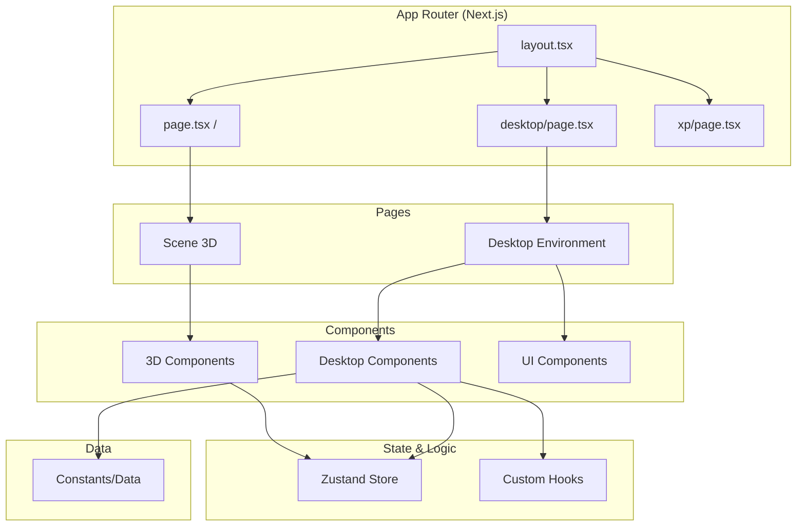

# Phase 2: Project Structure

> The organization of files and folders, and the conventions used throughout the project.

---

## 🎯 What Was Done

A clear, scalable folder structure was established to separate concerns and make the codebase maintainable. The project follows Next.js 13+ App Router conventions with additional organization for 3D components, hooks, and state management.

---

## 📁 Directory Structure

```
Portfolio/
├── 📁 src/
│   ├── 📁 app/                    # Next.js App Router
│   │   ├── 📄 layout.tsx          # Root layout (fonts, metadata)
│   │   ├── 📄 page.tsx            # Landing page (3D monitor)
│   │   ├── 📄 globals.css         # Global styles
│   │   ├── 📁 desktop/
│   │   │   └── 📄 page.tsx        # Desktop environment
│   │   └── 📁 xp/
│   │       └── 📄 page.tsx        # XP page (placeholder)
│   │
│   ├── 📁 components/             # React components
│   │   ├── 📁 3d/                 # Three.js/R3F components
│   │   │   ├── 📄 Computer.tsx    # Main computer wrapper
│   │   │   ├── 📄 ModelMonitor.tsx # FBX model + screen
│   │   │   └── 📄 Scene.tsx       # 3D scene setup
│   │   ├── 📁 desktop/            # Desktop UI components
│   │   │   ├── 📄 index.ts        # Barrel export
│   │   │   ├── 📄 CassetteWidget.tsx
│   │   │   ├── 📄 CvFilesWindow.tsx
│   │   │   ├── 📄 DesktopIcons.tsx
│   │   │   ├── 📄 GalleryWindow.tsx
│   │   │   ├── 📄 GamesWindow.tsx
│   │   │   ├── 📄 GitHubWidget.tsx
│   │   │   ├── 📄 MapWindow.tsx
│   │   │   ├── 📄 MusicPrompt.tsx
│   │   │   ├── 📄 ProfilePanel.tsx
│   │   │   ├── 📄 ProjectsWindow.tsx
│   │   │   ├── 📄 Taskbar.tsx
│   │   │   ├── 📄 TerminalWindow.tsx
│   │   │   ├── 📄 Topbar.tsx
│   │   │   └── 📄 VaporwaveBackground.tsx
│   │   └── 📁 ui/                 # Shared UI components
│   │       ├── 📄 Instructions.tsx
│   │       ├── 📄 RetroHeader.tsx
│   │       ├── 📄 ScreenAvatar.tsx
│   │       └── 📄 ScreenPrompt.tsx
│   │
│   ├── 📁 hooks/                  # Custom React hooks
│   │   ├── 📄 useClock.ts         # Time display hook
│   │   ├── 📄 useDraggable.ts     # Window dragging
│   │   ├── 📄 useTerminal.ts      # Terminal logic
│   │   └── 📄 useWindowManager.ts # Window state
│   │
│   ├── 📁 store/                  # Zustand stores
│   │   └── 📄 computerStore.ts    # Global computer state
│   │
│   ├── 📁 constants/              # Static data & types
│   │   └── 📄 desktopData.ts      # Games, projects, CV data
│   │
│   ├── 📁 styles/                 # Additional styles
│   │   ├── 📁 desktop/            # Desktop-specific CSS
│   │   │   ├── 📄 cassette.css
│   │   │   ├── 📄 cv-panel.css
│   │   │   ├── 📄 folder-icons.css
│   │   │   ├── 📄 gallery.css
│   │   │   ├── 📄 games.css
│   │   │   ├── 📄 map.css
│   │   │   ├── 📄 music-prompt.css
│   │   │   ├── 📄 nbwin.css       # Neobrutalist windows
│   │   │   ├── 📄 projects.css
│   │   │   ├── 📄 taskbar.css
│   │   │   ├── 📄 terminal.css
│   │   │   └── 📄 topbar.css
│   │   └── 📄 retro-ui.module.scss # SCSS module for landing
│   │
│   └── 📁 types/                  # TypeScript types
│       └── 📄 index.ts            # Re-exports from constants
│
├── 📁 public/                     # Static assets
│   ├── 📁 cv/                     # CV PDF files
│   ├── 📁 models/                 # 3D models (FBX)
│   ├── 📁 projects/               # Project screenshots
│   ├── 📄 bogi.png                # Avatar image
│   ├── 📄 favicon.ico
│   └── 📄 *.webp/png/jpg          # Game icons, etc.
│
├── 📁 Docu/                       # 📚 This documentation
└── 📄 config files...             # See [[02 - Core Configuration]]
```

---

## 🏗️ Architecture Diagram



---

## 📋 Naming Conventions

### Files
| Pattern | Used For | Example |
|---------|----------|---------|
| `PascalCase.tsx` | React components | `Computer.tsx`, `GamesWindow.tsx` |
| `camelCase.ts` | Utilities, hooks, stores | `useClock.ts`, `computerStore.ts` |
| `kebab-case.css` | CSS files | `taskbar.css`, `cv-panel.css` |
| `name.module.scss` | SCSS modules | `retro-ui.module.scss` |
| `index.ts` | Barrel exports | `components/desktop/index.ts` |

### Components
- **Functional components** with explicit return types where beneficial
- **Props interfaces** defined inline or in types file
- **Hooks** prefixed with `use` (React convention)

```typescript
// Component example
interface TerminalWindowProps {
  termLines: TerminalLine[];
  closeWin: (id: string) => void;
}

export function TerminalWindow({ termLines, closeWin }: TerminalWindowProps) {
  // ...
}
```

---

## 🎯 Key Architectural Decisions

### 1. App Router Structure

The App Router organizes pages by route:

```
app/
├── page.tsx           # Route: /
├── desktop/
│   └── page.tsx       # Route: /desktop
└── xp/
    └── page.tsx       # Route: /xp
```

> [!note] Benefits
> - Colocation of related files
> - Layout inheritance
> - Server Components by default

### 2. Component Organization

Components are grouped by domain:
- **`3d/`** — Three.js/React Three Fiber components
- **`desktop/`** — Desktop environment UI
- **`ui/`** — Shared, reusable UI components

### 3. Hook Extraction

Logic is extracted into custom hooks for reusability:
- `useClock()` — Time formatting
- `useDraggable()` — Window dragging
- `useTerminal()` — Terminal command handling
- `useWindowManager()` — Window open/close/z-index

### 4. Centralized Data

All data lives in `constants/desktopData.ts`:
```typescript
export const GAMES: Game[] = [...];
export const PROJECTS: Project[] = [...];
export const CV_FILES: CvFile[] = [...];
```

> [!tip] Why?
> - Easy to find and update content
> - Type-safe data with TypeScript interfaces
> - Separates content from presentation

---

## 🔗 Import Patterns

### Path Alias (`@/*`)

Configured in `tsconfig.json`:
```json
"paths": {
  "@/*": ["./src/*"]
}
```

Usage examples:
```typescript
// Components
import { Computer } from '@/components/3d/Computer';
import { GamesWindow } from '@/components/desktop/GamesWindow';

// Hooks & Store
import { useClock } from '@/hooks/useClock';
import { useComputerStore } from '@/store/computerStore';

// Data
import { GAMES, PROJECTS } from '@/constants/desktopData';

// Styles
import styles from '@/styles/retro-ui.module.scss';
```

### Barrel Exports

`components/desktop/index.ts` provides clean imports:
```typescript
// Instead of multiple imports:
import { TerminalWindow } from '@/components/desktop/TerminalWindow';
import { GamesWindow } from '@/components/desktop/GamesWindow';
import { Taskbar } from '@/components/desktop/Taskbar';

// Single import:
import { TerminalWindow, GamesWindow, Taskbar } from '@/components/desktop';
```

---

## 📚 Related Documentation

- [[TECH - Next.js|Next.js Deep Dive]] — App Router details
- [[04 - State Management|State Management]] — Zustand store organization
- [[09 - Desktop Architecture|Desktop Architecture]] — Component composition

---

## 📝 Summary

| Aspect | Decision | Rationale |
|--------|----------|-----------|
| Routing | App Router | Modern Next.js, layouts, streaming |
| Components | Domain-based folders | Clear separation of concerns |
| State | Zustand + Hooks | Lightweight, flexible |
| Data | Centralized constants | Easy content management |
| Styling | Tailwind + SCSS modules | Utility + component-scoped styles |
