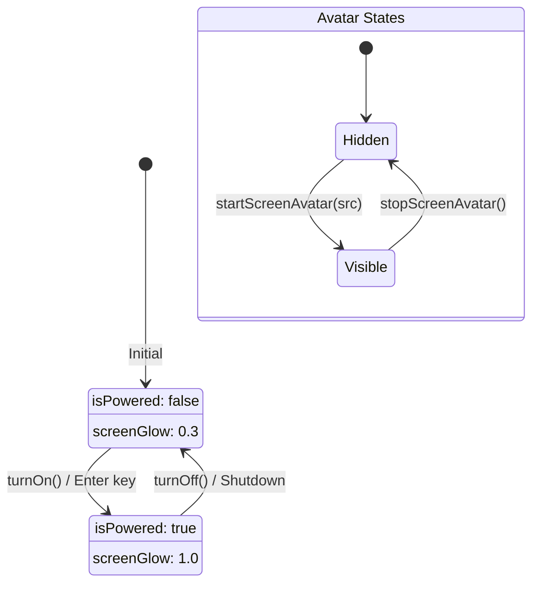
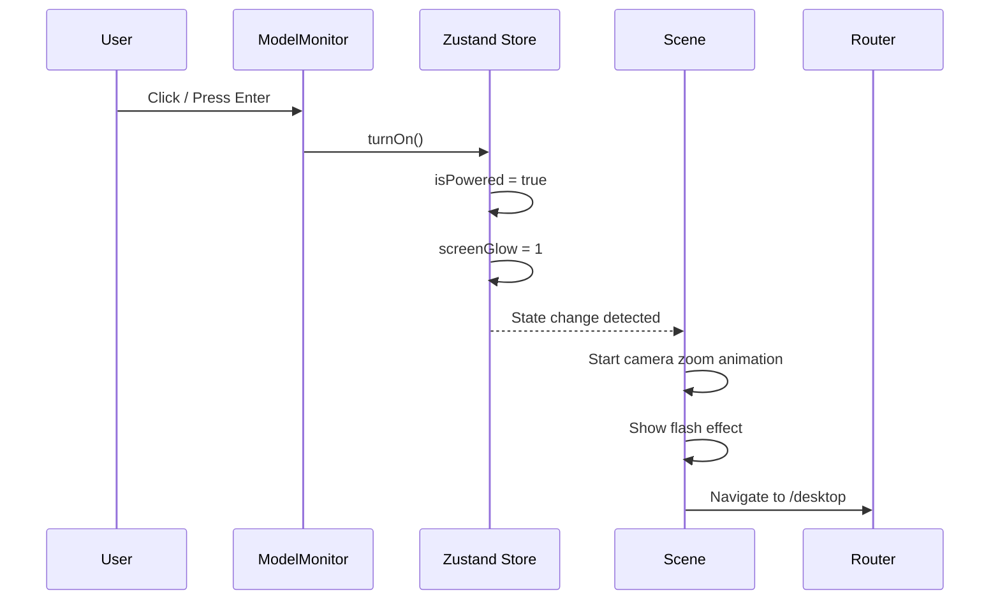

# Phase 2: State Management

> How global state is managed using Zustand for the 3D computer and landing page experience.

---

## 🎯 What Was Done

A lightweight, centralized state store was created using [[TECH - Zustand|Zustand]] to manage the "computer" state — whether the 3D monitor is powered on, screen glow intensity, and the floating avatar. This approach avoids prop drilling and keeps state logic testable and maintainable.

---

## 🏪 The Store: `computerStore.ts`

Located at: `src/store/computerStore.ts`

```typescript
import { create } from 'zustand';

interface ComputerState {
  // Power & Visual State
  isPowered: boolean;
  screenGlow: number;
  floatOffset: number;
  promptScreenPos: [number, number] | null;

  // Screen Avatar State
  avatarOnScreen: boolean;
  avatarSrc: string;

  // Actions
  turnOn: () => void;
  turnOff: () => void;
  setScreenGlow: (glow: number) => void;
  setFloatOffset: (offset: number) => void;
  setPromptScreenPos: (pos: [number, number] | null) => void;
  startScreenAvatar: (src?: string) => void;
  stopScreenAvatar: () => void;
}

export const useComputerStore = create<ComputerState>((set) => ({
  // Initial State
  isPowered: false,
  screenGlow: 0.3,
  floatOffset: 0,
  promptScreenPos: null,
  avatarOnScreen: false,
  avatarSrc: '/bogi.png',

  // Actions
  turnOn: () => set({ isPowered: true, screenGlow: 1 }),
  turnOff: () => set({ isPowered: false, screenGlow: 0.3 }),
  setScreenGlow: (glow) => set({ screenGlow: glow }),
  setFloatOffset: (offset) => set({ floatOffset: offset }),
  setPromptScreenPos: (pos) => set({ promptScreenPos: pos }),
  startScreenAvatar: (src = '/bogi.png') => set({ 
    avatarOnScreen: true, 
    avatarSrc: src 
  }),
  stopScreenAvatar: () => set({ avatarOnScreen: false }),
}));
```

---

## 📊 State Flow Diagram



---

## 🔌 Using the Store

### Basic Usage (Selectors)

Select specific state to prevent unnecessary re-renders:

```typescript
import { useComputerStore } from '@/store/computerStore';

function MyComponent() {
  // ✅ Good: Component only re-renders when isPowered changes
  const isPowered = useComputerStore((state) => state.isPowered);
  
  // ❌ Avoid: Subscribes to entire store
  const { isPowered, screenGlow } = useComputerStore();
  
  return <div>{isPowered ? 'ON' : 'OFF'}</div>;
}
```

### Accessing Actions

```typescript
function PowerButton() {
  const turnOn = useComputerStore((state) => state.turnOn);
  const turnOff = useComputerStore((state) => state.turnOff);
  const isPowered = useComputerStore((state) => state.isPowered);

  return (
    <button onClick={isPowered ? turnOff : turnOn}>
      {isPowered ? 'Power Off' : 'Power On'}
    </button>
  );
}
```

### Outside React Components

Access store state outside components (useful in callbacks, event handlers):

```typescript
import { useComputerStore } from '@/store/computerStore';

// Get current state
const currentState = useComputerStore.getState();
console.log(currentState.isPowered);

// Call actions directly
useComputerStore.getState().turnOn();
useComputerStore.getState().startScreenAvatar('/custom.png');
```

---

## 🎮 State in Action

### Power On Flow



### Terminal Avatar Control

The terminal can control the screen avatar via commands:

```typescript
// In useTerminal.ts
if (c === 'start avatar') {
  // Create orbiting avatar element
  const avatarEl = document.createElement('div');
  avatarEl.id = 'orbit-avatar';
  // ... setup animation
  
  printLine('out', '🤖 ORBIT.EXE started');
}

if (c.startsWith('start avatar ')) {
  const file = cmd.slice('start avatar '.length).trim();
  const src = file.startsWith('/') ? file : `/${file}`;
  useComputerStore.getState().startScreenAvatar(src);
  printLine('out', `BOGI.EXE started (${src})`);
}

if (c === 'stop avatar') {
  useComputerStore.getState().stopScreenAvatar();
  printLine('out', '🤖 ORBIT.EXE terminated');
}
```

---

## 🔧 Store Integration Points

| Component | State Used | Purpose |
|-----------|-----------|---------|
| `ModelMonitor.tsx` | `floatOffset`, `isPowered`, `turnOn` | Float animation, power click |
| `Scene.tsx` | `isPowered` | Camera zoom, flash effect |
| `page.tsx` (landing) | `isPowered` | Flash transition overlay |
| `ScreenAvatar.tsx` | `avatarOnScreen`, `avatarSrc` | Show/hide avatar |
| `desktop/page.tsx` | `turnOff` (via getState) | Shutdown handler |
| `useTerminal.ts` | `startScreenAvatar`, `stopScreenAvatar` | Terminal commands |

---

## 💡 Design Decisions

### Why Zustand?

| Feature | Benefit |
|---------|---------|
| **Lightweight** | ~1KB bundle size |
| **No boilerplate** | No providers, reducers, or action types |
| **TypeScript** | Excellent type inference |
| **Selectors** | Prevent unnecessary re-renders |
| **DevTools** | Redux DevTools integration |

### Why Not Context API?

Context API is built into React, but for this project:
- Zustand requires less boilerplate
- Better performance with selectors
- Easier to use outside React components

### Why Not Redux?

Redux is powerful but overkill for this project's needs:
- Single store with simple state shape
- No complex middleware requirements
- Zustand provides same devtools experience with less code

---

## 🧪 Testing the Store

```typescript
// Example test pattern
import { useComputerStore } from '@/store/computerStore';

// Reset store before each test
beforeEach(() => {
  useComputerStore.setState({
    isPowered: false,
    screenGlow: 0.3,
    avatarOnScreen: false,
  });
});

test('turnOn sets isPowered to true', () => {
  useComputerStore.getState().turnOn();
  expect(useComputerStore.getState().isPowered).toBe(true);
  expect(useComputerStore.getState().screenGlow).toBe(1);
});
```

---

## 🔗 Related Documentation

- [[TECH - Zustand|Zustand Technology Deep Dive]] — Complete Zustand guide
- [[06 - React Three Fiber Setup|React Three Fiber Setup]] — 3D scene integration
- [[11 - Terminal Implementation|Terminal Implementation]] — Terminal command handling

---

## 📝 Summary

| Aspect | Implementation |
|--------|---------------|
| Library | Zustand 5.x |
| Store file | `src/store/computerStore.ts` |
| State scope | Global (power, glow, avatar) |
| Access pattern | Selectors for reads, actions for writes |
| External access | `useComputerStore.getState()` |
| Persistence | None (ephemeral session state) |
