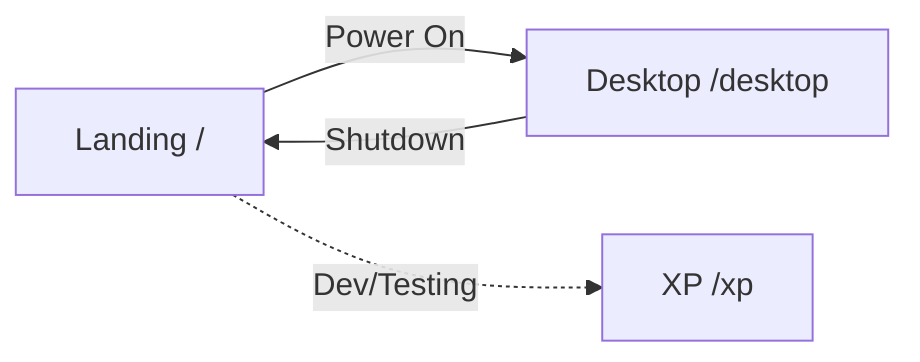
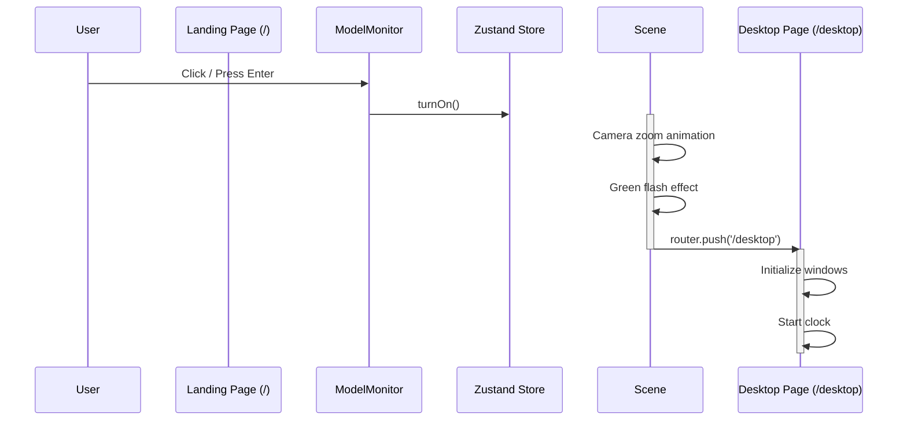
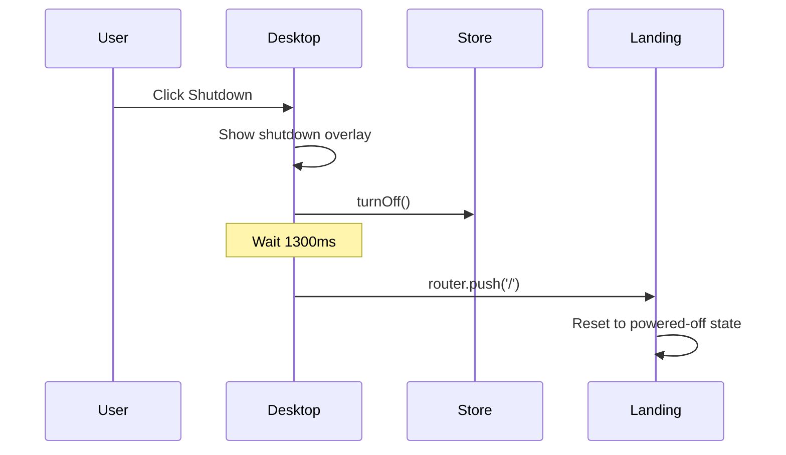

# Phase 2: Routing & Navigation

> How page routing works using Next.js App Router and the navigation flow between landing and desktop.

---

## 🎯 What Was Done

The application uses Next.js 13+ [[TECH - Next.js|App Router]] for file-system based routing. The navigation flow is designed as an experience: users start at the 3D landing page, "power on" the monitor, and transition to the desktop environment.

---

## 🗺️ Route Structure

```
URL Path          File Location                      Description
─────────────────────────────────────────────────────────────────────────
/                 src/app/page.tsx                   3D Landing (CRT Monitor)
/desktop          src/app/desktop/page.tsx           Desktop Environment
/xp               src/app/xp/page.tsx                XP Page (placeholder)
```



---

## 📁 Route Files

### Root Layout (`src/app/layout.tsx`)

The root layout wraps all pages and provides shared UI elements:

```typescript
export default function RootLayout({
  children,
}: Readonly<{
  children: React.ReactNode;
}>) {
  return (
    <html lang="en">
      <head>
        <link rel="icon" href="/favicon.ico" />
        <link rel="shortcut icon" href="/favicon.ico" />
      </head>
      <body className={`${geistSans.variable} ${geistMono.variable}`}>
        {children}
      </body>
    </html>
  );
}
```

> [!note] Layout Inheritance
> This layout is the parent of all routes. Each page's content is rendered where `{children}` appears.

---

### Landing Page (`src/app/page.tsx`)

Route: `/`

The entry point featuring the 3D CRT monitor:

```typescript
'use client';

import dynamic from 'next/dynamic';
import { useComputerStore } from '@/store/computerStore';

// Dynamic import to avoid SSR issues with Three.js
const Scene = dynamic(
  () => import('@/components/3d/Scene').then((mod) => mod.Scene),
  { ssr: false, loading: () => null }
);

export default function Home() {
  const isPowered = useComputerStore((s) => s.isPowered);
  
  // Flash effect when powered on
  // ...
  
  return (
    <main className={styles.main}>
      <RetroHeader />
      <Scene />
      <Instructions />
    </main>
  );
}
```

**Key features:**
- **Dynamic import** for Three.js scene (avoids SSR issues[^1])
- **Flash transition** effect when powering on
- **Zustand connection** for power state

[^1]: Three.js requires browser APIs (WebGL) that don't exist during server-side rendering.

---

### Desktop Page (`src/app/desktop/page.tsx`)

Route: `/desktop`

The main portfolio experience with retro desktop UI:

```typescript
'use client';

import { useRouter } from 'next/navigation';
import { useWindowManager } from '@/hooks/useWindowManager';
import { useTerminal } from '@/hooks/useTerminal';
// ... other imports

export default function Desktop() {
  const router = useRouter();
  const { bringToFront, openWin, closeWin } = useWindowManager();
  const terminal = useTerminal();
  
  // Shutdown handler
  const handleShutdown = useCallback(() => {
    setIsShuttingDown(true);
    useComputerStore.getState().turnOff();
    setTimeout(() => router.push('/'), 1300);
  }, [router]);

  return (
    <div id="desktop">
      <VaporwaveBackground />
      {/* Windows, widgets, taskbar */}
      <Taskbar onShutdown={handleShutdown} />
    </div>
  );
}
```

**Key features:**
- **Window management** via custom hook
- **Terminal state** via custom hook
- **Shutdown navigation** back to landing

---

### XP Page (`src/app/xp/page.tsx`)

Route: `/xp`

A minimal placeholder page:

```typescript
'use client';

import Link from 'next/link';

export default function XPPage() {
  return (
    <main style={{ width: '100vw', height: '100vh' }}>
      <Link href="/">Back</Link>
    </main>
  );
}
```

---

## 🔄 Navigation Flows

### 1. Landing → Desktop (Power On)



**Timing:**
- Power on: Immediate
- Camera zoom: ~1.5 seconds
- Navigation: After zoom completes

---

### 2. Desktop → Landing (Shutdown)



```typescript
const handleShutdown = useCallback(() => {
  setIsShuttingDown(true);
  useComputerStore.getState().turnOff();
  setTimeout(() => router.push('/'), 1300);
}, [router]);
```

---

## 🔗 Navigation Methods

### 1. Programmatic Navigation (`useRouter`)

```typescript
import { useRouter } from 'next/navigation';

function MyComponent() {
  const router = useRouter();
  
  const goToDesktop = () => {
    router.push('/desktop');
  };
  
  const goBack = () => {
    router.back();
  };
  
  return <button onClick={goToDesktop}>Go to Desktop</button>;
}
```

### 2. Link Component (Declarative)

```typescript
import Link from 'next/link';

function Navigation() {
  return (
    <nav>
      <Link href="/">Home</Link>
      <Link href="/desktop">Desktop</Link>
    </nav>
  );
}
```

> [!tip] When to use each
> - **`useRouter`**: Programmatic navigation (after actions, timeouts)
> - **`<Link>`**: User-clickable navigation (better UX, prefetching)

---

## 🎭 Client vs Server Components

All pages in this project are Client Components (`'use client'`) because they require browser APIs:

| Page | Needs Client? | Reason |
|------|--------------|--------|
| Landing (`/`) | ✅ Yes | Three.js WebGL |
| Desktop (`/desktop`) | ✅ Yes | DOM manipulation, window positioning |
| XP (`/xp`) | ✅ Yes | Consistency (though could be server) |

Future optimization could make XP a Server Component:
```typescript
// Could be server component (no 'use client')
export default function XPPage() {
  return <div>Static content</div>;
}
```

---

## 🚀 Dynamic Imports for Code Splitting

The 3D scene is dynamically imported to:
1. **Prevent SSR errors** (Three.js needs `window`)
2. **Code splitting** (scene loads separately)
3. **Loading state** (show fallback while loading)

```typescript
const Scene = dynamic(
  () => import('@/components/3d/Scene').then((mod) => mod.Scene),
  { 
    ssr: false,           // Don't render on server
    loading: () => <LoadingSpinner />  // Fallback UI
  }
);
```

---

## 🔗 Related Documentation

- [[TECH - Next.js|Next.js Deep Dive]] — App Router, SSR/CSR, routing patterns
- [[04 - State Management|State Management]] — How Zustand integrates with navigation
- [[06 - React Three Fiber Setup|React Three Fiber Setup]] — Why dynamic imports are needed

---

## 📝 Summary

| Aspect | Implementation |
|--------|---------------|
| Router | Next.js App Router |
| Navigation | `useRouter` hook + `<Link>` component |
| Landing → Desktop | Programmatic after power on |
| Desktop → Landing | Programmatic after shutdown |
| Code Splitting | Dynamic imports for 3D scene |
| SSR Handling | `ssr: false` for browser-dependent components |
