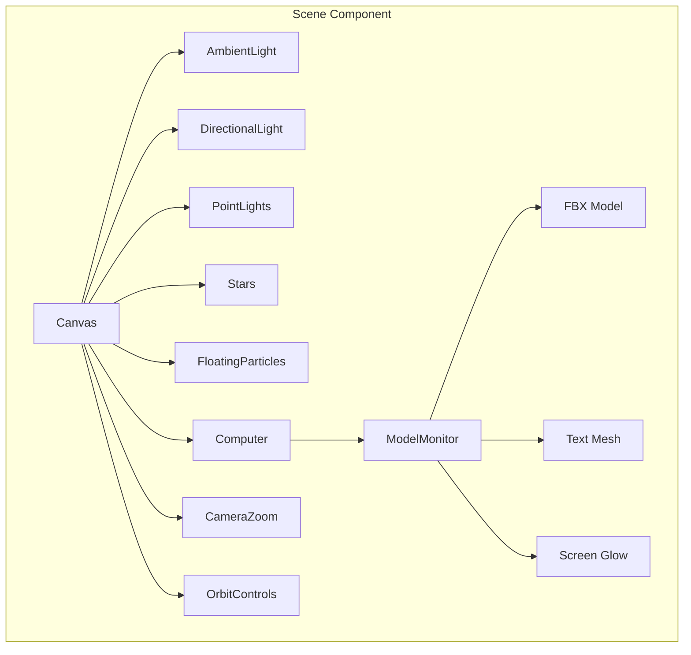
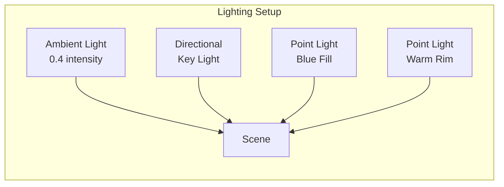

# Phase 3: React Three Fiber Setup

> Setting up the 3D scene using React Three Fiber, the React renderer for Three.js.

---

## 🎯 What Was Done

A 3D scene was created using [[TECH - React Three Fiber|React Three Fiber]] (R3F), allowing Three.js 3D content to be expressed as React components. The scene features a floating CRT monitor, starfield background, particle effects, and smooth camera animations.

---

## 📦 Dependencies

```json
{
  "@react-three/fiber": "^9.5.0",
  "@react-three/drei": "^10.7.7",
  "three": "^0.183.0",
  "@types/three": "^0.183.0",
  "three-stdlib": "^2.36.1"
}
```

| Package | Purpose |
|---------|---------|
| `@react-three/fiber` | React renderer for Three.js |
| `@react-three/drei` | Useful helpers (OrbitControls, Stars, etc.) |
| `three` | Core 3D library |
| `three-stdlib` | Additional loaders (FBXLoader) |

---

## 🏗️ Scene Architecture



---

## 🎨 The Canvas Component

The `Canvas` is the root of every R3F scene:

```typescript
import { Canvas } from '@react-three/fiber';

export function Scene() {
  return (
    <Canvas
      camera={{ position: [0, 0.5, 6], fov: 45 }}
      gl={{ antialias: true, alpha: true }}
      shadows
      style={{ width: '100%', height: '100%' }}
    >
      {/* Lights */}
      <ambientLight intensity={0.4} />
      <directionalLight 
        position={[5, 10, 7]} 
        intensity={1} 
        castShadow 
      />
      
      {/* Scene Contents */}
      <Stars />
      <FloatingParticles />
      <Computer />
      
      {/* Controls */}
      <OrbitControls />
    </Canvas>
  );
}
```

### Canvas Props Explained

| Prop | Value | Purpose |
|------|-------|---------|
| `camera` | `{ position: [0, 0.5, 6], fov: 45 }` | Initial camera position and field of view |
| `gl.antialias` | `true` | Smoother edges |
| `gl.alpha` | `true` | Transparent background |
| `shadows` | `true` | Enable shadow mapping |

---

## 💡 Lighting Setup

The scene uses a three-point lighting approach:

```typescript
{/* Ambient - base illumination */}
<ambientLight intensity={0.4} />

{/* Key light - main illumination with shadows */}
<directionalLight 
  position={[5, 10, 7]} 
  intensity={1} 
  castShadow 
  shadow-mapSize-width={2048}
  shadow-mapSize-height={2048}
/>

{/* Fill light - blue tint from left */}
<pointLight position={[-5, 5, -5]} intensity={0.5} color="#4a9eff" />

{/* Rim light - warm from below/right */}
<pointLight position={[5, -5, 5]} intensity={0.3} color="#ffaa77" />
```



---

## 🌟 Background Effects

### Stars (from Drei)

```typescript
import { Stars } from '@react-three/drei';

<Stars 
  radius={100}      // Size of starfield
  depth={50}        // Depth of field
  count={5000}      // Number of stars
  factor={4}        // Star size factor
  saturation={0.5}  // Color saturation
  fade              // Fade with distance
  speed={0.5}       // Rotation speed
/>
```

### Floating Particles

Custom particle system with continuous rotation:

```typescript
function FloatingParticles() {
  const particlesRef = useRef<Group>(null);
  
  useFrame((state) => {
    if (particlesRef.current) {
      particlesRef.current.rotation.y = state.clock.elapsedTime * 0.05;
    }
  });

  return (
    <group ref={particlesRef}>
      {Array.from({ length: 50 }).map((_, i) => (
        <mesh key={i} position={[randomX, randomY, randomZ]}>
          <sphereGeometry args={[size, 8, 8]} />
          <meshBasicMaterial color="#4a9eff" transparent opacity={0.6} />
        </mesh>
      ))}
    </group>
  );
}
```

---

## 🎥 Camera Animation

When the computer is powered on, the camera zooms toward the screen:

```typescript
function CameraZoom({ isZooming }: { isZooming: boolean }) {
  const { camera } = useThree();
  const targetPos = useRef(new Vector3(0.3, 0.9, 0));
  
  useFrame((state, delta) => {
    if (isZooming) {
      // Smooth interpolation toward target
      camera.position.lerp(targetPos.current, delta * 3);
      
      // Animate FOV for dramatic effect
      const targetFOV = 20;
      if ((camera as any).fov > targetFOV) {
        (camera as any).fov -= delta * 30;
        (camera as any).updateProjectionMatrix();
      }
    }
  });
  
  return null;
}
```

---

## 🎮 Camera Controls

OrbitControls allow users to rotate around the scene:

```typescript
import { OrbitControls } from '@react-three/drei';

<OrbitControls 
  enablePan={false}           // Disable panning
  enableZoom={false}          // Disable zoom
  minDistance={3}             // Minimum zoom distance
  maxDistance={8}             // Maximum zoom distance
  minPolarAngle={Math.PI / 6}     // Limit vertical rotation (top)
  maxPolarAngle={Math.PI / 1.5}   // Limit vertical rotation (bottom)
  target={[0, 0.5, 0]}        // Point to orbit around
  enableRotate={!isPowered}    // Disable when powered on
/>
```

> [!tip] User Experience
> Controls are disabled during the power-on animation to prevent interference with the camera zoom effect.

---

## 🔧 The useFrame Hook

`useFrame` is R3F's render loop hook, called every frame:

```typescript
import { useFrame } from '@react-three/fiber';

function AnimatedComponent() {
  const meshRef = useRef<Mesh>(null);
  
  useFrame((state, delta) => {
    // state.clock.elapsedTime - total time since mount
    // delta - time since last frame
    
    if (meshRef.current) {
      meshRef.current.rotation.y += delta;
    }
  });
  
  return <mesh ref={meshRef} />;
}
```

### Common useFrame Patterns

| Pattern | Code |
|---------|------|
| Rotation | `rotation.y += delta * speed` |
| Oscillation | `position.y = Math.sin(time) * amplitude` |
| Lerp | `position.lerp(target, delta * speed)` |
| Scale pulse | `scale.setScalar(1 + Math.sin(time) * 0.1)` |

---

## 🔄 SSR Considerations

Three.js requires browser APIs (WebGL) that don't exist during server-side rendering. The scene component is dynamically imported:

```typescript
// In page.tsx
import dynamic from 'next/dynamic';

const Scene = dynamic(
  () => import('@/components/3d/Scene').then((mod) => mod.Scene),
  { 
    ssr: false,              // Skip server rendering
    loading: () => null      // Show nothing while loading
  }
);
```

> [!warning] Important
> Any file importing `three` or `@react-three/fiber` must either:
> 1. Be dynamically imported with `ssr: false`
> 2. Be marked with `'use client'` AND only render on mount

---

## 🔗 Related Documentation

- [[TECH - React Three Fiber|React Three Fiber Deep Dive]] — Complete R3F guide
- [[TECH - Three.js|Three.js Deep Dive]] — Core 3D concepts
- [[07 - The CRT Monitor Model|The CRT Monitor Model]] — The 3D model implementation
- [[08 - Scene Effects|Scene Effects]] — Visual effects details

---

## 📝 Summary

| Aspect | Implementation |
|--------|---------------|
| Renderer | `@react-three/fiber` Canvas |
| Helpers | `@react-three/drei` |
| Lighting | 3-point (ambient + directional + 2 point lights) |
| Background | Stars + Floating particles |
| Animation | `useFrame` hook |
| Controls | OrbitControls (disabled during zoom) |
| SSR | Dynamic import with `ssr: false` |
