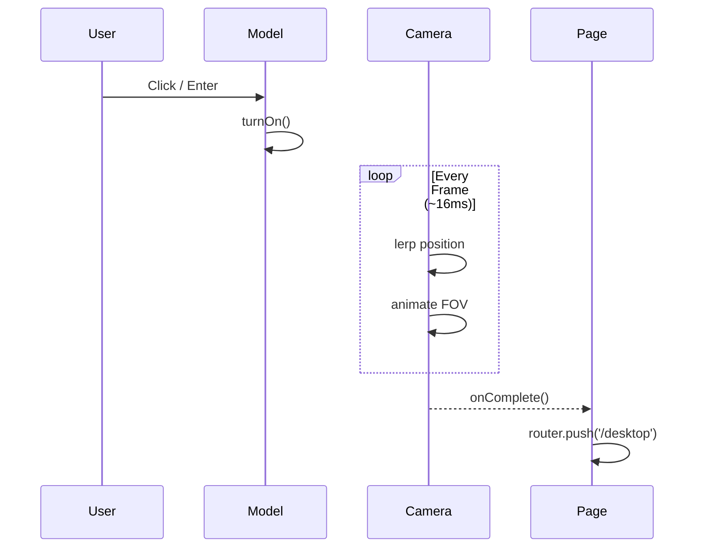

# Phase 3: The CRT Monitor Model

> Loading and animating the 3D CRT monitor model with interactive screen effects.

---

## 🎯 What Was Done

A retro CRT monitor model is loaded from an FBX file and enhanced with interactive elements: a blinking text prompt, screen glow effects, and a smooth camera zoom transition when powered on.

---

## 📁 Model File

```
public/models/crt-monitor.fbx
```

The model was created separately and exported in FBX format, a common 3D interchange format supported by most 3D software (Blender, Maya, 3ds Max).

---

## 🏗️ Component Architecture

```mermaid
graph TB
    subgraph "ModelMonitor Component"
        FBX[FBX Model<br/>primitive object]
        TEXT[Text Mesh<br/>CanvasTexture]
        GLOW[Screen Glow<br/>Emissive Plane]
        
        FBX --> PROCESS[Process Materials]
        PROCESS --> STD[MeshStandardMaterial]
        
        TEXT --> ANIM[Text Animation]
        ANIM --> CURSOR[Blinking Cursor]
        
        GLOW --> POWER[Show on Power On]
    end
    
    subgraph "Interactions"
        CLICK[Click Handler] --> TURNON[turnOn()]
        KEY[Enter Key] --> TURNON
        TURNON --> ZOOM[Camera Zoom]
        ZOOM --> NAV[Navigate /desktop]
    end
```

---

## 🔧 Model Loading with FBXLoader

```typescript
import { useLoader } from '@react-three/fiber';
import { FBXLoader } from 'three-stdlib';

function ModelContent() {
  // Load FBX model
  const fbx = useLoader(FBXLoader, '/models/crt-monitor.fbx');
  
  useEffect(() => {
    if (!fbx) return;
    
    // Traverse and modify materials
    fbx.traverse((child) => {
      if ((child as Mesh).isMesh) {
        const mesh = child as Mesh;
        
        // Hide original screen (we'll render our own)
        const meshName = (mesh.name || '').toLowerCase();
        const matName = (mesh.material as any)?.name?.toLowerCase() || '';
        
        if (meshName.includes('screen') || matName.includes('screen')) {
          mesh.visible = false;
          return;
        }
        
        // Replace materials with PBR materials
        mesh.castShadow = true;
        mesh.receiveShadow = true;
        
        if (mesh.material) {
          mesh.material = new MeshStandardMaterial({
            color: oldMat.color || 0xd4d4d4,
            roughness: oldMat.roughness || 0.4,
            metalness: oldMat.metalness || 0.1,
          });
        }
      }
    });
  }, [fbx]);
  
  return <primitive object={fbx} scale={0.02} />;
}
```

### Why Replace Materials?

| Original | Replacement | Reason |
|----------|-------------|--------|
| FBX materials | `MeshStandardMaterial` | Better PBR rendering in Three.js |
| Imported colors | Standardized colors | Consistent appearance |
| Unknown roughness | Controlled roughness | Predictable lighting response |

---

## 🖥️ The Screen Text

The "Press ENTER to turn on" text is rendered using a `CanvasTexture`:

```typescript
const textTexture = useMemo(() => {
  const canvas = document.createElement('canvas');
  canvas.width = 800;
  canvas.height = 120;
  const ctx = canvas.getContext('2d')!;
  
  // Background
  ctx.fillStyle = 'rgba(0, 0, 0, 0.85)';
  ctx.fillRect(0, 0, canvas.width, canvas.height);
  
  // Text styling
  ctx.font = 'bold 48px "Courier New", monospace';
  ctx.textAlign = 'center';
  ctx.textBaseline = 'middle';
  ctx.fillStyle = '#00ff41';
  ctx.shadowColor = '#00ff41';
  ctx.shadowBlur = 25;
  
  ctx.fillText('Press ENTER to turn on _', canvas.width / 2, canvas.height / 2);
  
  return new CanvasTexture(canvas);
}, []);
```

### Blinking Cursor Animation

```typescript
useFrame((state) => {
  if (!isPowered && textCanvasRef.current) {
    const canvas = textCanvasRef.current;
    const ctx = canvas.getContext('2d')!;
    
    // Redraw background
    ctx.fillStyle = 'rgba(0, 0, 0, 0.85)';
    ctx.fillRect(0, 0, canvas.width, canvas.height);
    
    // Blink cursor every 0.5 seconds
    const t = state.clock.elapsedTime;
    const cursorOn = Math.floor(t * 2) % 2 === 0;
    
    const text = `Press ENTER to turn on${cursorOn ? ' _' : ''}`;
    ctx.fillText(text, canvas.width / 2, canvas.height / 2);
    
    // Mark texture for update
    (textTexture as CanvasTexture).needsUpdate = true;
  }
});
```

---

## ✨ Screen Glow Effect

When powered on, a bright green glow plane appears behind the text:

```typescript
{isAnimating && (
  <mesh ref={screenRef} position={[0.35, 0.9, 0]} rotation={[0, -Math.PI / 2, 0]}>
    <planeGeometry args={[1.4, 1.0]} />
    <meshStandardMaterial
      color="#00ff41"
      emissive="#00ff41"
      emissiveIntensity={5}
      toneMapped={false}
      transparent
      opacity={0.8}
    />
  </mesh>
)}
```

### Material Properties

| Property | Value | Effect |
|----------|-------|--------|
| `color` | `#00ff41` | Base green color |
| `emissive` | `#00ff41` | Self-illumination color |
| `emissiveIntensity` | `5` | How bright it glows |
| `toneMapped` | `false` | Prevents color clamping |

---

## 🎬 Power On Animation

When the user clicks or presses Enter, the computer powers on:

```typescript
function CameraZoomAnimation({ isAnimating, onComplete }) {
  const { camera } = useThree();
  const progressRef = useRef(0);
  const initialPos = useRef(camera.position.clone());
  const targetPos = useRef(new Vector3(0.4, 0.9, 0));
  
  useFrame((state, delta) => {
    if (isAnimating) {
      progressRef.current += delta * 0.8;
      
      if (progressRef.current >= 1) {
        progressRef.current = 1;
        onComplete();  // Navigate to /desktop
      }
      
      // Cubic easing for smooth acceleration
      const t = progressRef.current;
      const easeIn = t * t * t;
      
      // Interpolate position
      camera.position.lerpVectors(initialPos.current, targetPos.current, easeIn);
      
      // Zoom FOV
      (camera as any).fov = 45 + (10 - 45) * easeIn;
      (camera as any).updateProjectionMatrix();
    }
  });
  
  return null;
}
```

### Animation Sequence



---

## 🎮 Interaction Handlers

```typescript
// Click handler
const handleTextClick = () => {
  if (!isPowered) {
    turnOn();
  }
};

// Keyboard handler
useEffect(() => {
  const handleKeyDown = (e: KeyboardEvent) => {
    if (e.key === 'Enter' && !isPowered) {
      turnOn();
    }
  };
  window.addEventListener('keydown', handleKeyDown);
  return () => window.removeEventListener('keydown', handleKeyDown);
}, [isPowered, turnOn]);
```

---

## 📐 Position Reference

```typescript
// Text position constants
const TEXT_POSITION: [number, number, number] = [0.0, 2.1, 0.3];
const TEXT_ROTATION: [number, number, number] = [0, 1.7 * Math.PI / 180, 0];
```

These values were tuned to position the text floating above the monitor model.

---

## 🔗 Related Documentation

- [[TECH - Three.js|Three.js Deep Dive]] — Materials, textures, lighting
- [[06 - React Three Fiber Setup|React Three Fiber Setup]] — R3F basics
- [[04 - State Management|State Management]] — How power state is managed

---

## 📝 Summary

| Aspect | Implementation |
|--------|---------------|
| Model Format | FBX |
| Loader | `FBXLoader` from `three-stdlib` |
| Screen Text | `CanvasTexture` with 2D canvas API |
| Animation | `useFrame` + cubic easing |
| Glow | `MeshStandardMaterial` with emissive |
| Interactions | Click + Keyboard (Enter) |
| Navigation | `router.push('/desktop')` after animation |
