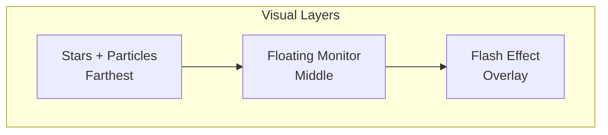

# Phase 3: Scene Effects

> Visual effects that enhance the 3D scene: floating animation, stars, particles, and the power-on transition.

---

## 🎯 What Was Done

Multiple visual effects were implemented to create an immersive retro-futuristic atmosphere: floating hover animation for the monitor, a starfield background, floating particles, and a dramatic flash transition when powering on.

---

## 🌊 Floating Animation

The entire computer model gently floats up and down, creating a hovering effect:

```typescript
// In Computer.tsx
export function Computer() {
  const groupRef = useRef<Group>(null);
  const setFloatOffset = useComputerStore((state) => state.setFloatOffset);

  useFrame((state) => {
    // Vertical float: sine wave with 0.8 speed, 0.15 amplitude
    const floatY = Math.sin(state.clock.elapsedTime * 0.8) * 0.15;
    setFloatOffset(floatY);
    
    // Subtle rotation: sine wave with 0.3 speed, ~3 degrees amplitude
    if (groupRef.current) {
      groupRef.current.rotation.y = Math.sin(state.clock.elapsedTime * 0.3) * 0.05;
    }
  });

  return (
    <group ref={groupRef} scale={0.6} position={[0, -0.5, 0]}>
      <ModelMonitor />
    </group>
  );
}
```

### Animation Parameters

| Parameter | Value | Effect |
|-----------|-------|--------|
| `speed * 0.8` | Vertical oscillation period | ~7.8 seconds per cycle |
| `amplitude * 0.15` | Vertical movement range | ±0.15 units |
| `rotation speed * 0.3` | Rotation period | ~21 seconds per cycle |
| `rotation amplitude * 0.05` | Rotation angle | ~±3 degrees |

### Float Offset in Store

The `floatOffset` is stored in Zustand so other components (like `ModelMonitor`) can access it:

```typescript
// In computerStore.ts
interface ComputerState {
  floatOffset: number;
  setFloatOffset: (offset: number) => void;
}

// Applied to model position
<group position={[0, floatOffset, 0]}>
```

---

## 🌟 Starfield Background

The `@react-three/drei` `Stars` component creates a dynamic starfield:

```typescript
import { Stars } from '@react-three/drei';

<Stars 
  radius={100}      // Radius of the star sphere
  depth={50}        // Depth of the star field
  count={5000}      // Number of stars
  factor={4}        // Star size multiplier
  saturation={0.5}  // Color saturation (0 = white)
  fade              // Stars fade with distance
  speed={0.5}       // Rotation speed
/>
```

### Visual Properties

| Prop | Effect |
|------|--------|
| `radius` | Stars are distributed on a sphere of this radius |
| `depth` | Creates depth variation for parallax effect |
| `count` | More stars = denser field but more GPU load |
| `factor` | Larger values = bigger stars |
| `fade` | Stars become transparent at edges |

---

## ✨ Floating Particles

Custom particle system with 50 blue spheres orbiting slowly:

```typescript
function FloatingParticles() {
  const particlesRef = useRef<Group>(null);
  
  useFrame((state) => {
    if (particlesRef.current) {
      // Rotate entire group slowly
      particlesRef.current.rotation.y = state.clock.elapsedTime * 0.05;
    }
  });

  return (
    <group ref={particlesRef}>
      {Array.from({ length: 50 }).map((_, i) => {
        // Random position in a 20x20x20 cube
        const x = (Math.random() - 0.5) * 20;
        const y = (Math.random() - 0.5) * 20;
        const z = (Math.random() - 0.5) * 20;
        
        // Random size between 0.02 and 0.07
        const size = Math.random() * 0.05 + 0.02;
        
        return (
          <mesh key={i} position={[x, y, z]}>
            <sphereGeometry args={[size, 8, 8]} />
            <meshBasicMaterial 
              color="#4a9eff" 
              transparent 
              opacity={0.6} 
            />
          </mesh>
        );
      })}
    </group>
  );
}
```

### Particle Characteristics

| Aspect | Value |
|--------|-------|
| Count | 50 particles |
| Distribution | Random in 20×20×20 cube |
| Size | 0.02–0.07 units |
| Color | `#4a9eff` (bright blue) |
| Opacity | 60% transparent |
| Animation | Full group rotation |

---

## ⚡ Power-On Flash Transition

When the monitor is powered on, a full-screen flash effect transitions to the desktop:

### Scene-Level Flash (3D)

```typescript
// In Scene.tsx - Green overlay during zoom
{isZooming && (
  <div style={{
    position: 'fixed',
    inset: 0,
    background: '#00ff41',
    opacity: isPowered ? 1 : 0,
    pointerEvents: 'none',
    transition: 'opacity 0.5s ease-in',
    zIndex: 9999,
  }} />
)}
```

### Page-Level Flash (React)

```typescript
// In page.tsx - Radial gradient flash
{showFlash && (
  <div 
    className={styles.screenFlash}
    style={{
      position: 'fixed',
      inset: 0,
      background: 'radial-gradient(circle, #ffffff 0%, #00ff41 50%, #000000 100%)',
      zIndex: 9999,
      animation: 'flash-zoom 1.5s ease-in forwards',
    }}
  />
)}

<style jsx global>{`
  @keyframes flash-zoom {
    0% {
      opacity: 0;
      transform: scale(0.1);
    }
    50% {
      opacity: 1;
      transform: scale(1);
    }
    100% {
      opacity: 1;
      transform: scale(3);
    }
  }
`}</style>
```

### Flash Animation Timeline

```mermaid
gantt
    title Power-On Animation Timeline
    dateFormat X
    axisFormat %s
    
    section User Action
    Click/Enter    :0, 1
    
    section Store
    turnOn()       :0, 1
    
    section Visual
    Camera Zoom    :0, 1500
    Green Flash    :0, 1500
    Screen Glow    :0, 1500
    
    section Navigation
    Wait           :0, 1500
    Navigate       :1500, 1600
```



---

## 💡 Lighting Effects

The scene uses carefully positioned lights to enhance the retro aesthetic:

### Point Light Animation (Optional Enhancement)

```typescript
// Pulsing fill light
useFrame((state) => {
  const intensity = 0.5 + Math.sin(state.clock.elapsedTime * 2) * 0.2;
  pointLightRef.current.intensity = intensity;
});
```

### Color Palette

The scene uses a vaporwave-inspired color scheme:

| Element | Color | Hex |
|---------|-------|-----|
| Screen text | Matrix Green | `#00ff41` |
| Fill light | Electric Blue | `#4a9eff` |
| Rim light | Warm Orange | `#ffaa77` |
| Particles | Light Blue | `#4a9eff` |
| Flash | Bright Green | `#00ff41` |

---

## 🎨 Visual Hierarchy



---

## 🔧 Performance Considerations

| Effect | Optimization |
|--------|--------------|
| 50 Particles | Low-poly spheres (8 segments) |
| 5000 Stars | Drei uses instancing internally |
| Floating animation | Single `useFrame` updates group |
| Flash overlay | `pointer-events: none` allows clicks through |

---

## 🔗 Related Documentation

- [[06 - React Three Fiber Setup|React Three Fiber Setup]] — Scene architecture
- [[07 - The CRT Monitor Model|The CRT Monitor Model]] — Model details
- [[TECH - Three.js|Three.js Deep Dive]] — Materials and lighting

---

## 📝 Summary

| Effect | Implementation |
|--------|---------------|
| Floating | `useFrame` + sine wave on Y position |
| Rotation | `useFrame` + sine wave on Y rotation |
| Stars | `@react-three/drei` `Stars` component |
| Particles | 50 `mesh` elements in rotating `group` |
| Flash | CSS animation + fixed overlay |
| Colors | Vaporwave palette (greens, blues, oranges) |
