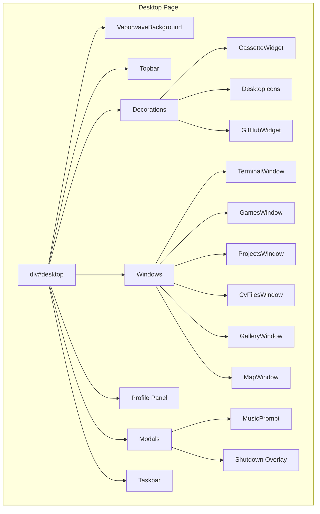
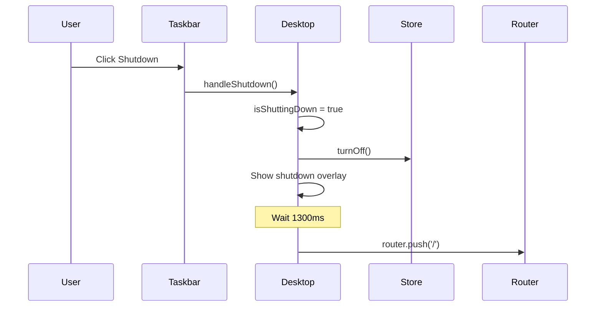

# Phase 4: Desktop Architecture

> The structure and organization of the retro desktop environment page.

---

## 🎯 What Was Done

The `/desktop` route renders a complete retro desktop environment featuring draggable windows, a taskbar, widgets, and interactive content. The architecture separates concerns into hooks for logic and components for UI.

---

## 🏗️ Page Structure



---

## 📄 Main Component (`desktop/page.tsx`)

```typescript
'use client';

import { useEffect, useState, useCallback } from 'react';
import { useRouter } from 'next/navigation';

// Hooks
import { useClock } from '@/hooks/useClock';
import { useWindowManager } from '@/hooks/useWindowManager';
import { initDraggables } from '@/hooks/useDraggable';
import { useTerminal } from '@/hooks/useTerminal';

// Store & Components
import { useComputerStore } from '@/store/computerStore';
import ScreenAvatar from '@/components/ui/ScreenAvatar';
import {
  VaporwaveBackground, Topbar, Taskbar,
  TerminalWindow, GamesWindow, ProjectsWindow,
  CvFilesWindow, GalleryWindow, MapWindow,
  ProfilePanel, CassetteWidget, MusicPrompt,
  DesktopIcons, GitHubWidget,
} from '@/components/desktop';

export default function Desktop() {
  const router = useRouter();
  const time = useClock();
  const { bringToFront, openWin, closeWin, toggleWin } = useWindowManager();
  const terminal = useTerminal();

  // Local state
  const [isShuttingDown, setIsShuttingDown] = useState(false);
  const [musicPrompt, setMusicPrompt] = useState(true);
  const [musicAutoplay, setMusicAutoplay] = useState(false);

  // Initialize draggable windows
  useEffect(() => { initDraggables(bringToFront); }, [bringToFront]);

  // Shutdown handler
  const handleShutdown = useCallback(() => {
    setIsShuttingDown(true);
    useComputerStore.getState().turnOff();
    setTimeout(() => router.push('/'), 1300);
  }, [router]);

  return (
    <div id="desktop">
      <VaporwaveBackground />
      {isShuttingDown && <div className="shutdown-overlay" />}

      <Topbar time={time} />

      {/* Decorations */}
      <CassetteWidget musicAutoplay={musicAutoplay} />
      <DesktopIcons openWin={openWin} />
      <GitHubWidget />

      {/* Windows */}
      <TerminalWindow ... />
      <GamesWindow ... />
      <ProjectsWindow ... />
      <CvFilesWindow ... />
      <GalleryWindow ... />
      <MapWindow ... />

      {/* Profile */}
      <ProfilePanel bringToFront={bringToFront} />
      <ScreenAvatar />

      {/* Modals */}
      <MusicPrompt ... />

      <Taskbar time={time} onShutdown={handleShutdown} toggleWin={toggleWin} />
    </div>
  );
}
```

---

## 🎨 Vaporwave Background

The desktop features an animated vaporwave aesthetic background:

```typescript
export function VaporwaveBackground() {
  return (
    <div className="vaporwave-bg">
      <canvas id="bg-canvas" />
      <div className="sun" />
      <div className="grid" />
    </div>
  );
}
```

Visual elements:
- **Canvas animation** — Moving gradient/stars
- **Sun** — Retro sun with gradient
- **Grid** — Perspective grid floor
- **Color palette** — Pinks, purples, cyans

---

## 🪟 Window System

All windows share common characteristics:

| Feature | Implementation |
|---------|---------------|
| Draggable | `useDraggable` hook + `.draggable` class |
| Z-index | Managed by `useWindowManager` |
| Close | `closeWin(id)` function |
| Bring to front | Click triggers `bringToFront(el)` |

### Window IDs

```typescript
const WINDOW_IDS = {
  TERMINAL: 'code-win',
  GAMES: 'games-win',
  PROJECTS: 'projects-win',
  CV: 'cv-win',
  GALLERY: 'gallery-win',
  MAP: 'map-win',
} as const;
```

---

## 🎮 Desktop Icons

Clickable icons that open windows:

```typescript
export function DesktopIcons({ openWin }) {
  return (
    <div className="desktop-icons">
      <div className="icon" onClick={() => openWin('code-win')}>
        
        <span>Terminal</span>
      </div>
      <div className="icon" onClick={() => openWin('games-win')}>
        
        <span>Games.exe</span>
      </div>
      {/* ... more icons */}
    </div>
  );
}
```

---

## ⏰ Clock Display

The `useClock` hook provides formatted time:

```typescript
const time = useClock(); // "14:32:07"
```

Displayed in:
- **Topbar** — Center position
- **Taskbar** — Right corner

---

## 🔌 Shutdown Flow



---

## 📁 Component Exports

All desktop components are exported from `components/desktop/index.ts`:

```typescript
// Barrel export pattern
export { VaporwaveBackground } from './VaporwaveBackground';
export { Topbar } from './Topbar';
export { Taskbar } from './Taskbar';
export { TerminalWindow } from './TerminalWindow';
export { GamesWindow } from './GamesWindow';
export { ProjectsWindow } from './ProjectsWindow';
export { CvFilesWindow } from './CvFilesWindow';
export { GalleryWindow } from './GalleryWindow';
export { MapWindow } from './MapWindow';
export { ProfilePanel } from './ProfilePanel';
export { CassetteWidget } from './CassetteWidget';
export { MusicPrompt } from './MusicPrompt';
export { DesktopIcons } from './DesktopIcons';
export { GitHubWidget } from './GitHubWidget';
```

---

## 🔗 Related Documentation

- [[10 - Window Management System|Window Management System]] — Dragging, z-index, open/close
- [[11 - Terminal Implementation|Terminal Implementation]] — Terminal window details
- [[12 - Desktop Components|Desktop Components]] — Individual window implementations
- [[13 - Styling Architecture|Styling Architecture]] — CSS organization

---

## 📝 Summary

| Aspect | Implementation |
|--------|---------------|
| Background | Vaporwave canvas + CSS |
| Windows | 6 draggable windows |
| Decorations | Cassette, icons, GitHub widget |
| State | React `useState` + Zustand |
| Clock | `useClock` hook |
| Shutdown | 1300ms delay + navigation |
| Music | Autoplay prompt modal |
