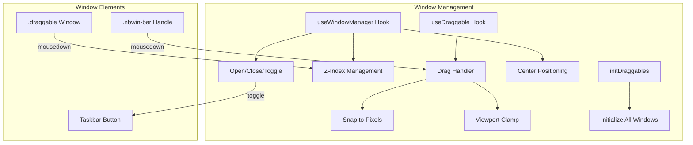
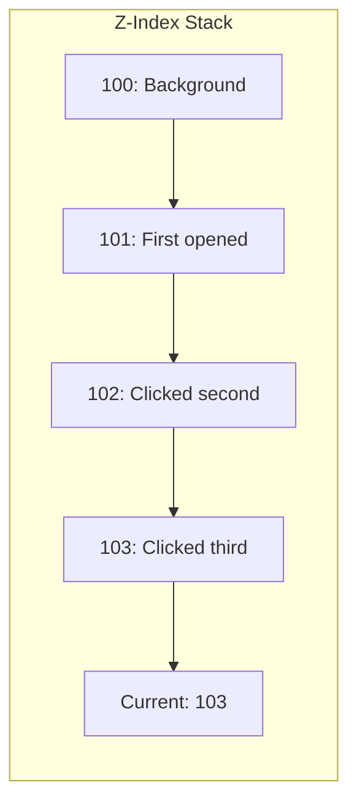

# Phase 4: Window Management System

> How draggable windows are implemented, including z-index management, positioning, and user interactions.

---

## 🎯 What Was Done

A complete window management system was built that allows users to drag windows, bring them to front, open/close/toggle them, and keep them within viewport bounds. The system uses vanilla DOM manipulation for performance and flexibility.

---

## 🏗️ Architecture Overview



---

## 📐 The `useWindowManager` Hook

Located at: `src/hooks/useWindowManager.ts`

```typescript
import { useCallback, useRef } from 'react';

export function useWindowManager() {
  const zCounterRef = useRef(100);  // Starting z-index

  /** Bring window to front by incrementing z-index */
  const bringToFront = useCallback((el: HTMLElement | null) => {
    if (!el) return;
    zCounterRef.current += 1;
    el.style.zIndex = String(zCounterRef.current);
  }, []);

  /** Open window: center it, show it, activate taskbar */
  const openWin = useCallback((id: string, tbId?: string) => {
    const w = document.getElementById(id);
    const tb = tbId ? document.getElementById(tbId) : null;
    if (!w) return;

    w.classList.add('open');
    w.style.removeProperty('display');

    // Center on viewport
    const vw = window.innerWidth;
    const vh = window.innerHeight;
    const rect = w.getBoundingClientRect();
    const topbarH = 36;
    const taskbarH = 48;
    
    const left = Math.max(0, (vw - rect.width) / 2);
    const top = Math.max(topbarH, (vh - taskbarH - rect.height) / 2);
    
    w.style.left = `${left}px`;
    w.style.top = `${top}px`;
    w.style.right = 'auto';
    w.style.bottom = 'auto';

    if (tb) tb.classList.add('active');
    bringToFront(w);
  }, [bringToFront]);

  /** Close window: hide it, deactivate taskbar */
  const closeWin = useCallback((id: string, tbId?: string) => {
    const w = document.getElementById(id);
    const tb = tbId ? document.getElementById(tbId) : null;
    if (!w) return;
    
    w.classList.remove('open');
    w.style.display = 'none';
    if (tb) tb.classList.remove('active');
  }, []);

  /** Toggle window: open if hidden, close if visible */
  const toggleWin = useCallback((id: string, tbId?: string) => {
    const w = document.getElementById(id);
    if (!w) return;

    const isHidden = getComputedStyle(w).display === 'none';
    if (isHidden) {
      openWin(id, tbId);
    } else {
      w.style.display = 'none';
      w.classList.remove('open');
      if (tbId) document.getElementById(tbId)?.classList.remove('active');
    }
  }, [openWin]);

  return { bringToFront, openWin, closeWin, toggleWin };
}
```

---

## 🖱️ Drag Implementation

### `initDraggables` Function

This function wires up all windows with the `.draggable` class:

```typescript
export function initDraggables(bringToFront: (el: HTMLElement) => void) {
  document.querySelectorAll<HTMLElement>('.draggable').forEach((el) => {
    // Prevent duplicate initialization
    if (el.dataset.dragInit === '1') return;
    el.dataset.dragInit = '1';

    const handle = el.querySelector<HTMLElement>('.nbwin-bar');
    if (!handle) return;

    // Click anywhere to bring to front
    el.addEventListener('mousedown', () => bringToFront(el));

    // Drag start
    handle.addEventListener('mousedown', (e: MouseEvent) => {
      e.preventDefault();

      // Convert from CSS transform to pixel positioning
      const elRect = el.getBoundingClientRect();
      const par = el.offsetParent as HTMLElement | null;
      const parRect = par ? par.getBoundingClientRect() : { left: 0, top: 0 };

      const startLeft = elRect.left - parRect.left;
      const startTop = elRect.top - parRect.top;

      // Disable CSS transforms (they interfere with drag)
      el.style.transform = 'none';
      el.style.animation = 'none';
      el.style.left = `${startLeft}px`;
      el.style.top = `${startTop}px`;

      bringToFront(el);
      freezeIframes();  // Prevent iframe capture

      const startMouseX = e.clientX;
      const startMouseY = e.clientY;

      // Drag move
      const onMove = (me: MouseEvent) => {
        const x = Math.max(
          0,
          Math.min(window.innerWidth - el.offsetWidth,
            startLeft + (me.clientX - startMouseX)),
        );
        const y = Math.max(
          36,  // Below topbar
          Math.min(window.innerHeight - el.offsetHeight - 48,  // Above taskbar
            startTop + (me.clientY - startMouseY)),
        );
        el.style.left = `${x}px`;
        el.style.top = `${y}px`;
      };

      // Drag end
      const onUp = () => {
        document.removeEventListener('mousemove', onMove);
        document.removeEventListener('mouseup', onUp);
        thawIframes();
      };

      document.addEventListener('mousemove', onMove);
      document.addEventListener('mouseup', onUp);
    });
  });
}
```

### Drag Features

| Feature | Implementation |
|---------|---------------|
| Handle-based | Only `.nbwin-bar` initiates drag |
| Snap to pixels | Converts %/transform to px on first drag |
| Viewport clamp | Prevents dragging off-screen |
| Auto front | Clicking brings window to front |
| Iframe handling | Disables iframes during drag |

---

## 🪟 Window HTML Structure

```html
<div id="code-win" class="draggable nbwin" style="display: none;">
  <div class="nbwin-bar">
    <span>Terminal</span>
    <button onclick="closeWin('code-win')">×</button>
  </div>
  <div class="nbwin-content">
    <!-- Window content -->
  </div>
</div>
```

### CSS Classes

| Class | Purpose |
|-------|---------|
| `.draggable` | Marks element as draggable |
| `.nbwin` | Neobrutalist window styling |
| `.nbwin-bar` | Drag handle + title bar |
| `.nbwin-content` | Scrollable content area |
| `.open` | Visible state |

---

## 📊 Z-Index Management



Each interaction increments the counter:
- Window opens → `z-index: 101`
- User clicks another → `z-index: 102`
- User clicks first again → `z-index: 103`

---

## 🔗 Taskbar Integration

Taskbar buttons toggle windows and show active state:

```typescript
// In Taskbar.tsx
<button 
  id="tb-code" 
  onClick={() => toggleWin('code-win', 'tb-code')}
  className="taskbar-btn"
>
  Terminal
</button>
```

```css
/* Active state when window is open */
.taskbar-btn.active {
  background: var(--accent);
  box-shadow: inset 2px 2px 0 rgba(0,0,0,0.3);
}
```

---

## 🎯 Window Positioning Logic

```
Viewport Centering Formula:

left = max(0, (viewportWidth - windowWidth) / 2)
top  = max(topbarHeight, 
           (viewportHeight - taskbarHeight - windowHeight) / 2)

Constraints:
- left ≥ 0 (can't go off left edge)
- top ≥ 36 (below topbar)
- bottom ≥ 48 (above taskbar)
```

---

## 🔗 Related Documentation

- [[12 - Desktop Components|Desktop Components]] — Individual window implementations
- [[13 - Styling Architecture|Styling Architecture]] — Window CSS styling
- [[TECH - React & TypeScript|React & TypeScript]] — Hooks patterns

---

## 📝 Summary

| Feature | Implementation |
|---------|---------------|
| Dragging | Vanilla JS mousedown/mousemove/mouseup |
| Z-Index | Counter ref, incremented on interaction |
| Open | Remove `display: none`, center, bring to front |
| Close | Set `display: none`, remove `.open` class |
| Toggle | Check computed style, open or close |
| Bounds | Clamp to viewport minus topbar/taskbar |
| Init | `useEffect` with `initDraggables` |
