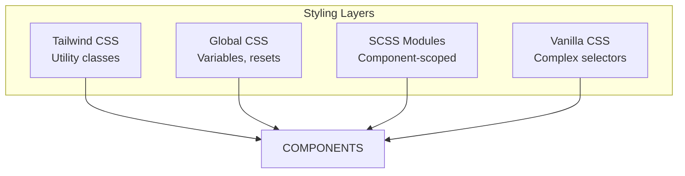

# Phase 4: Styling Architecture

> How styles are organized: Tailwind CSS, SCSS modules, and vanilla CSS files.

---

## 🎯 What Was Done

A hybrid styling approach combines [[TECH - Tailwind CSS|Tailwind CSS]] for utilities, SCSS modules for component-scoped styles, and vanilla CSS for complex desktop window styling.

---

## 🏗️ Stacking Strategy



---

## 🌊 Tailwind CSS

Used for quick utility styling in components:

```typescript
// Example usage
<div className="flex items-center justify-between p-4 bg-black/50 rounded">
```

### Configuration

Tailwind v4 uses CSS-based configuration in `globals.css`:

```css
@tailwind base;
@tailwind components;
@tailwind utilities;
```

> [!note] Tailwind v4
> This project uses Tailwind v4 which has a different configuration approach than v3. See [[TECH - Tailwind CSS|Tailwind CSS Deep Dive]] for details.

---

## 🎨 Global Styles (`globals.css`)

Base styles and CSS variables:

```css
:root {
  --background: #ffffff;
  --foreground: #171717;
  
  /* Vaporwave palette */
  --neon-pink: #ff00ff;
  --neon-cyan: #00ffff;
  --neon-purple: #9d00ff;
  --matrix-green: #00ff41;
}

body {
  color: var(--foreground);
  background: var(--background);
}
```

---

## 📦 SCSS Modules

Used for the landing page with complex scoped styles:

```scss
/* styles/retro-ui.module.scss */
.main {
  width: 100vw;
  height: 100vh;
  background: linear-gradient(135deg, #1a1a2e 0%, #16213e 100%);
  overflow: hidden;
}

.canvasContainer {
  position: absolute;
  inset: 0;
  z-index: 1;
}

.screenFlash {
  position: fixed;
  inset: 0;
  /* ... flash animation styles */
}
```

### Usage

```typescript
import styles from '@/styles/retro-ui.module.scss';

export default function Home() {
  return (
    <main className={styles.main}>
      <div className={styles.canvasContainer}>
        <Scene />
      </div>
    </main>
  );
}
```

> [!tip] Module Benefits
> - Class names are scoped (no conflicts)
> - Only used styles are included
> - TypeScript support with `*.module.scss` declarations

---

## 🪟 Desktop CSS Files

The desktop uses vanilla CSS for complex window styling:

```
src/styles/desktop/
├── cassette.css        # Cassette widget styling
├── cv-panel.css        # CV popup panel
├── folder-icons.css    # Desktop icon grid
├── gallery.css         # Gallery grid and lightbox
├── games.css           # Games list and detail
├── map.css             # SVG map styling
├── music-prompt.css    # Music modal
├── nbwin.css           # Neobrutalist window base
├── projects.css        # Project cards
├── taskbar.css         # Bottom taskbar
├── terminal.css        # Terminal output/input
└── topbar.css          # Top system bar
```

### Neobrutalist Window Base (`nbwin.css`)

```css
/* Base window styles */
.nbwin {
  position: absolute;
  background: #fff;
  border: 3px solid #000;
  box-shadow: 8px 8px 0 #000;
  min-width: 300px;
  min-height: 200px;
}

/* Title bar / drag handle */
.nbwin-bar {
  display: flex;
  justify-content: space-between;
  align-items: center;
  padding: 8px 12px;
  background: #000;
  color: #fff;
  cursor: move;
  user-select: none;
}

/* Window content area */
.nbwin-content {
  padding: 16px;
  overflow: auto;
  max-height: calc(100vh - 200px);
}

/* Close button */
.nbwin-bar button {
  background: none;
  border: none;
  color: #fff;
  font-size: 20px;
  cursor: pointer;
}
```

### Importing Desktop Styles

```typescript
// In desktop/page.tsx or layout
import '@/styles/desktop/nbwin.css';
import '@/styles/desktop/taskbar.css';
import '@/styles/desktop/terminal.css';
// ... etc
```

---

## 🎨 Neobrutalist Design System

The desktop uses neobrutalism — a bold, high-contrast style:

### Characteristics

| Element | Style |
|---------|-------|
| Borders | Thick (2-4px), solid black |
| Shadows | Hard offset shadows (no blur) |
| Colors | High contrast, limited palette |
| Typography | Bold, system fonts |
| Buttons | Rectangular, obvious |

### Example Components

```css
/* Button */
.neo-btn {
  background: #fff;
  border: 3px solid #000;
  padding: 8px 16px;
  font-weight: bold;
  box-shadow: 4px 4px 0 #000;
  transition: all 0.1s;
}

.neo-btn:active {
  transform: translate(2px, 2px);
  box-shadow: 2px 2px 0 #000;
}

/* Card */
.neo-card {
  background: #fff;
  border: 3px solid #000;
  padding: 16px;
  box-shadow: 6px 6px 0 #000;
}
```

---

## 🌈 Vaporwave Aesthetic

The background and accents use vaporwave colors:

```css
/* Vaporwave palette */
:root {
  --vw-pink: #ff00ff;
  --vw-cyan: #00ffff;
  --vw-purple: #9d00ff;
  --vw-yellow: #ffff00;
  --vw-grid: rgba(255, 0, 255, 0.3);
}

/* Vaporwave background */
.vaporwave-bg {
  background: linear-gradient(
    180deg,
    #1a0b2e 0%,
    #2d1b4e 40%,
    #ff006e 100%
  );
}

/* Retro grid */
.vaporwave-grid {
  background-image: 
    linear-gradient(var(--vw-grid) 1px, transparent 1px),
    linear-gradient(90deg, var(--vw-grid) 1px, transparent 1px);
  background-size: 40px 40px;
  transform: perspective(500px) rotateX(60deg);
}
```

---

## 📱 Responsive Considerations

The desktop is designed for desktop viewing:

```css
/* Minimum window sizes */
.nbwin {
  min-width: 300px;
  min-height: 200px;
  max-width: 90vw;
  max-height: 80vh;
}

/* Viewport constraints */
.draggable {
  /* Clamped by JS to keep within viewport */
}
```

---

## 🔗 Related Documentation

- [[TECH - Tailwind CSS|Tailwind CSS Deep Dive]] — Utility framework details
- [[09 - Desktop Architecture|Desktop Architecture]] — Component structure
- [[12 - Desktop Components|Desktop Components]] — Window implementations

---

## 📝 Summary

| Approach | Use Case | Files |
|----------|----------|-------|
| Tailwind | Quick utilities, spacing, colors | JSX className |
| SCSS Modules | Landing page, complex animations | `*.module.scss` |
| Vanilla CSS | Desktop windows, neobrutalism | `styles/desktop/*.css` |
| Global CSS | Variables, resets, base | `globals.css` |

| Design System | Characteristics |
|---------------|---------------|
| Neobrutalism | Hard shadows, thick borders, bold contrast |
| Vaporwave | Pink/cyan/purple gradients, retro grid, sun |
