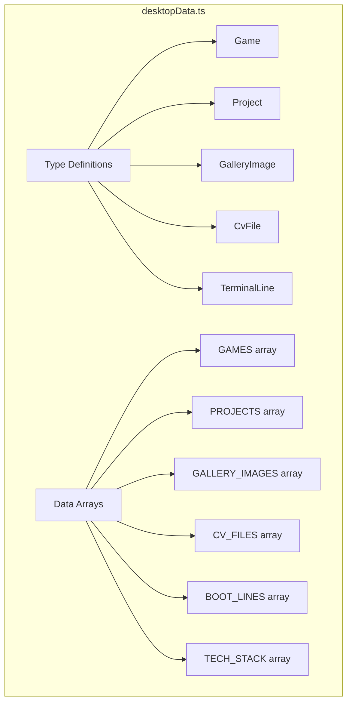

# Phase 5: Data Architecture

> How data is organized, typed, and used throughout the application.

---

## 🎯 What Was Done

All static data (games, projects, CV files, gallery images) is centralized in a single file with TypeScript interfaces. This separates content from presentation and makes updates easy.

---

## 📁 Data File Structure

```
src/constants/desktopData.ts
```



---

## 🏷️ Type Definitions

### Game

```typescript
export interface Game {
  name: string;       // Display name
  icon?: string;      // Image path in /public
  emoji?: string;     // Fallback emoji if no icon
  genre: string;      // Game genre
  platform: string;   // Platforms (PC, Xbox, etc.)
  desc: string;       // Description/review
  rating: number;     // 1-5 star rating
}
```

### Project

```typescript
export interface ProjectImage {
  src: string;        // Path relative to /public
  caption: string;    // Thumbnail caption
}

export interface Project {
  file: string;           // Filename for display
  name: string;           // Project name
  tech: string[];         // Tech stack tags
  desc: string;           // Full description
  image?: string;         // Main thumbnail
  githubUrl?: string;     // GitHub repo link
  liveUrl?: string;       // Live demo link
  images?: ProjectImage[]; // Gallery images
}
```

### Gallery Image

```typescript
export interface GalleryImage {
  src: string;        // Image path
  title: string;      // Image title
  description: string;// Full description
}
```

### CV File

```typescript
export interface CvFile {
  file: string;   // Filename
  label: string;  // Display label
  icon: string;   // Emoji icon
  path: string;   // Download path
}
```

### Terminal

```typescript
export interface TerminalLine {
  type: 'in' | 'out' | 'sys' | 'err';
  text: string;
}
```

---

## 📊 Data Arrays

### Games

```typescript
export const GAMES: Game[] = [
  {
    name: 'Fable',
    icon: '/fable.webp',
    genre: 'Action RPG',
    platform: 'PC/Xbox',
    desc: 'The most timeless franchise where details still mattered...',
    rating: 5,
  },
  {
    name: 'Diablo IV',
    icon: '/lilith.webp',
    genre: 'Action RPG',
    platform: 'PC',
    desc: "Dark, gothic, and ruthless...",
    rating: 4,
  },
  // ... 7 more games
];
```

### Projects

```typescript
export const PROJECTS: Project[] = [
  {
    file: 'portfolio.tsx',
    name: 'Portfolio Website',
    tech: ['React', 'Three.js', 'Next.js', 'TypeScript'],
    desc: 'This very website — a neobrutalist vaporwave portfolio...',
    image: '/projects/portfolio.png',
    githubUrl: 'https://github.com/BogisGatze/portfolio',
    liveUrl: 'https://bogisgatze.github.io/portfolio',
  },
  // ... 4 more projects
];
```

### Tech Stack

```typescript
export const TECH_STACK = [
  { name: 'React', hot: true },
  { name: 'Kotlin', hot: true },
  { name: 'Three.js', hot: true },
  { name: 'C#', hot: true },
  { name: 'Java', hot: false },
  { name: 'JavaScript', hot: false },
  { name: 'HTML/CSS', hot: false },
  { name: 'XML', hot: false },
  { name: 'Blazor', hot: false },
  { name: 'PHP', hot: false },
] as const;
```

### Hobbies

```typescript
export const HOBBIES = [
  'TFT — dangerously addicted, send help',
  'Reading — fiction, fantasy, anything good',
  'Movies — always watching something new',
  'Gaming — see Games.exe for the full list',
] as const;
```

---

## 🔗 Type Re-exports

Types are re-exported from `src/types/index.ts` for cleaner imports:

```typescript
/**
 * Shared type definitions for the portfolio app.
 * Re-exported from constants/desktopData for backwards compatibility.
 */
export type {
  Game,
  Project,
  ProjectImage,
  GalleryImage,
  CvFile,
  TerminalLine,
} from '@/constants/desktopData';
```

This allows imports like:
```typescript
import type { Game, Project } from '@/types';
```

---

## 📸 Image Assets

Images are stored in `public/` and referenced by path:

```
public/
├── bogi.png                    # Avatar image
├── fable.webp                  # Game icons
├── lilith.webp
├── tft.png
├── sprigatito.png
├── sims_transparent.png
├── nobody.png
├── cultofthelamb.jpg
├── assassin.png
├── cv/                         # CV PDFs
│   ├── Bogi_CV_2025.pdf
│   ├── Cover_Letter.pdf
│   └── Certificates.pdf
├── models/                     # 3D models
│   └── crt-monitor.fbx
└── projects/                   # Project screenshots
    ├── portfolio.png
    ├── debateduel1.png
    ├── debateduel2.png
    ├── library.png
    ├── weather.png
    └── taskmaster.png
```

---

## 🎯 Design Decisions

### Why Centralized Data?

| Benefit | Explanation |
|---------|-------------|
| Single source of truth | Update once, reflect everywhere |
| Type safety | TypeScript catches errors |
| Easy to find | All content in one file |
| Version control | Track content changes in git |

### Why Separate Types?

```typescript
// ✅ Interface - can be extended, better errors
export interface Game { ... }

// ❌ Type alias - less flexible for extension
export type Game = { ... };
```

### `as const` Assertion

```typescript
export const TECH_STACK = [...] as const;
```

This makes the array readonly and preserves literal types, enabling better autocompletion.

---

## 🔧 Usage Examples

### In Components

```typescript
import { GAMES, PROJECTS, CV_FILES } from '@/constants/desktopData';

function GamesWindow() {
  return (
    <div>
      {GAMES.map((game) => (
        <GameCard key={game.name} game={game} />
      ))}
    </div>
  );
}
```

### In Hooks

```typescript
import { BOOT_LINES, TECH_STACK, PROJECTS } from '@/constants/desktopData';

function useTerminal() {
  const [lines, setLines] = useState([...BOOT_LINES]);
  
  const showStack = () => {
    return TECH_STACK.map(t => t.name).join(', ');
  };
  
  const listProjects = () => {
    return PROJECTS.map(p => p.name);
  };
}
```

---

## 🔗 Related Documentation

- [[12 - Desktop Components|Desktop Components]] — How data is rendered
- [[11 - Terminal Implementation|Terminal Implementation]] — Terminal data usage
- [[TECH - React & TypeScript|React & TypeScript]] — TypeScript patterns

---

## 📝 Summary

| Aspect | Implementation |
|--------|---------------|
| Location | `src/constants/desktopData.ts` |
| Types | TypeScript interfaces |
| Data | `const` arrays with `as const` |
| Images | `public/` folder |
| Type exports | `src/types/index.ts` re-exports |
