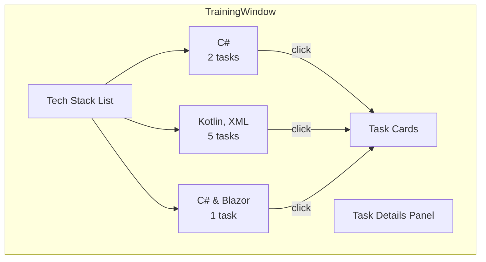

# Phase 5: Training / Ausbildung Window

> A window showcasing training experience organized by tech stack.

---

## 🎯 What Was Done

A desktop window displays training tasks organized by **tech stack** instead of departments: **C#**, **Kotlin/XML**, and **C# & Blazor**. This avoids mentioning specific company departments while still showing technical skills gained during the Ausbildung.

---

## 📁 File Structure

```
src/
├── components/desktop/
│   └── TrainingWindow.tsx      # Training window component
├── constants/desktopData.ts     # Tech stack data types and arrays
└── styles/desktop/
    └── training.css           # Window styling
```

---

## 🏗️ Component Architecture



---

## 🏷️ Type Definitions

```typescript
// From constants/desktopData.ts
export interface TrainingTask {
  title: string;
  description: string;
  duration?: string;
  learnings?: string[];
}

export interface TechStack {
  id: string;
  name: string;
  icon: string;
  tasks: TrainingTask[];
}
```

---

## 📊 Data Structure

```typescript
export const TRAINING_STACKS: TechStack[] = [
  {
    id: 'csharp',
    name: 'C#',
    icon: '🔷',
    tasks: [
      { title: 'Task 1', description: '...' },
      { title: 'Task 2', description: '...' },
    ],
  },
  {
    id: 'kotlin-xml',
    name: 'Kotlin, XML',
    icon: '🟣',
    tasks: [
      { title: 'Task 1', description: '...' },
      { title: 'Task 2', description: '...' },
      { title: 'Task 3', description: '...' },
      { title: 'Task 4', description: '...' },
      { title: 'Task 5', description: '...' },
    ],
  },
  {
    id: 'csharp-blazor',
    name: 'C# & Blazor',
    icon: '🔶',
    tasks: [
      { title: 'Task 1', description: '...' },
    ],
  },
];
```

---

## 🎨 UI Layout

### Tech Stack List (Left Sidebar)

- Tech icon (emoji)
- Tech name
- Task count
- Click to select

### Task Details (Right Panel)

- Tech header with large icon
- Task cards with:
  - Task number badge
  - Duration (optional)
  - Title
  - Description
  - Key learnings list (optional)

---

## 🖱️ Desktop Integration

### Desktop Icon

```
Icon: 🎓 (yellow folder)
Label: "Training"
Position: Below "My Gallery"
```

### Taskbar Button

```
Icon: 🎓
Label: "Training"
ID: tb-training
```

### Window Properties

```css
#training-win {
  width: 700px;
  height: 500px;
  background: var(--yellow);
}
```

---

## 📝 Task Card Format

```
┌─────────────────────────────────────┐
│ [TASK 1]          [duration]        │
│ Task Title                          │
│ Description text...                 │
│ ─────────────────────────────────── │
│ KEY LEARNINGS:                      │
│ • Learning 1                        │
│ • Learning 2                        │
│ • Learning 3                        │
└─────────────────────────────────────┘
```

---

## 🎨 Styling Highlights

| Element | Style |
|---------|-------|
| Window background | Yellow (`--yellow`) |
| Sidebar | Mint (`--mint`) |
| Tech cards | White bg, black border, shadow |
| Hover state | Cyan (`--cyan`) |
| Active tech | Purple (`--purple`) with white text |
| Task number badge | Pink (`--pink`) |

---

## 🔗 Related Documentation

- [[10 - Window Management System|Window Management System]] — Draggable windows
- [[12 - Desktop Components|Desktop Components]] — Other window types
- [[14 - Data Architecture|Data Architecture]] — Data patterns

---

## 📝 Summary

| Aspect | Implementation |
|--------|---------------|
| Component | `TrainingWindow.tsx` |
| Data | `TECH_STACKS` array |
| Organization | By tech stack (not department) |
| Tech Stacks | 3 (C#, Kotlin/XML, C# & Blazor) |
| Total Tasks | 8 (2 + 5 + 1) |
