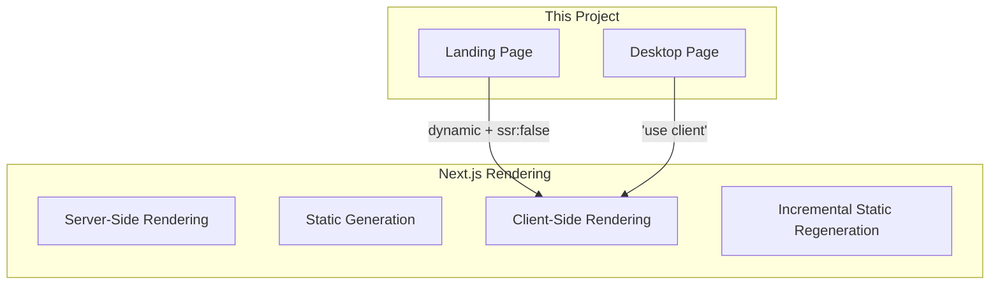

# Technology Deep Dive: Next.js

> Next.js is the React framework used for this portfolio, providing routing, rendering, and optimization features.

---

## 🎯 What is Next.js?

Next.js is a React framework that provides:
- **File-system routing** — Pages are files
- **Rendering strategies** — Server, Client, Static, ISR
- **Optimizations** — Images, fonts, scripts
- **Development experience** — Fast refresh, TypeScript support

---

## 📁 App Router (Next.js 13+)

This project uses the App Router, the modern Next.js routing system.

### File Conventions

```
app/
├── layout.tsx      # Root layout (wraps all pages)
├── page.tsx        # Home page (route: /)
├── loading.tsx     # Loading UI (optional)
├── error.tsx       # Error boundary (optional)
├── not-found.tsx   # 404 page (optional)
├── desktop/
│   ├── page.tsx    # Desktop page (route: /desktop)
│   └── layout.tsx  # Desktop layout (optional)
└── xp/
    └── page.tsx    # XP page (route: /xp)
```

### Layout vs Page

| File | Purpose | Renders |
|------|---------|---------|
| `layout.tsx` | Shared UI wrapper | Persists across navigation |
| `page.tsx` | Route content | Changes per route |

```typescript
// app/layout.tsx - Shared across all routes
export default function RootLayout({ children }) {
  return (
    <html>
      <body>{children}</body>
    </html>
  );
}

// app/page.tsx - Content for /
export default function HomePage() {
  return <h1>Home</h1>;
}

// app/desktop/page.tsx - Content for /desktop
export default function DesktopPage() {
  return <h1>Desktop</h1>;
}
```

---

## ⚡ Server vs Client Components

### Server Components (Default)

```typescript
// No 'use client' directive
async function ServerComponent() {
  const data = await fetch('https://api.example.com/data');
  return <div>{data}</div>;
}
```

- Render on the server
- Can access backend resources directly
- Smaller client bundle
- **Cannot** use browser APIs, hooks, or event handlers

### Client Components

```typescript
'use client';

import { useState } from 'react';

function ClientComponent() {
  const [count, setCount] = useState(0);
  return <button onClick={() => setCount(c => c + 1)}>{count}</button>;
}
```

- Render in the browser
- Can use all React features (hooks, effects, etc.)
- Can use browser APIs
- Must add `'use client'` directive

### This Project's Approach

All pages are Client Components because they require browser APIs:

```typescript
'use client'; // Required for Three.js (WebGL)

// Landing page uses 3D rendering
export default function Home() { ... }
```

```typescript
'use client'; // Required for DOM manipulation

// Desktop page manipulates DOM for windows
export default function Desktop() { ... }
```

---

## 🔗 Navigation

### Link Component

For client-side navigation without page refresh:

```typescript
import Link from 'next/link';

<Link href="/desktop">Go to Desktop</Link>
```

### useRouter Hook

For programmatic navigation:

```typescript
'use client';

import { useRouter } from 'next/navigation';

function MyComponent() {
  const router = useRouter();
  
  const goToDesktop = () => {
    router.push('/desktop');    // Navigate to /desktop
    router.back();               // Go back
    router.forward();            // Go forward
    router.refresh();            // Refresh current route
  };
}
```

### This Project's Usage

```typescript
// Landing page → Desktop (after power on)
const router = useRouter();

const handlePowerOn = () => {
  // ... animation
  setTimeout(() => router.push('/desktop'), 1500);
};

// Desktop → Landing (shutdown)
const handleShutdown = () => {
  setIsShuttingDown(true);
  setTimeout(() => router.push('/'), 1300);
};
```

---

## 🖼️ Dynamic Imports

Load components on demand for code splitting:

```typescript
import dynamic from 'next/dynamic';

// Dynamic import with SSR disabled
const Scene = dynamic(
  () => import('@/components/3d/Scene').then(mod => mod.Scene),
  { 
    ssr: false,              // Don't render on server
    loading: () => <Loading />  // Show while loading
  }
);
```

### Why `ssr: false`?

Three.js requires browser APIs (WebGL) that don't exist on the server:

```typescript
// ❌ This would fail during build
import { Scene } from '@/components/3d/Scene';

// ✅ This works - only loads in browser
const Scene = dynamic(() => import('@/components/3d/Scene'), { 
  ssr: false 
});
```

---

## 🔧 Configuration

### next.config.ts

```typescript
import type { NextConfig } from "next";

const nextConfig: NextConfig = {
  // Static export for GitHub Pages
  output: 'export',
  distDir: 'dist',
  
  // Image optimization for static export
  images: {
    unoptimized: true,
  },
  
  // Base path for GitHub Pages
  basePath: '/portfolio',
  
  // Trailing slashes
  trailingSlash: true,
};

export default nextConfig;
```

### Common Options

| Option | Description |
|--------|-------------|
| `output: 'export'` | Generate static HTML |
| `distDir` | Output directory |
| `images.unoptimized` | Required for static export |
| `basePath` | Prefix for all routes |

---

## 🎯 Rendering Strategies



### What This Project Uses

| Page | Strategy | Reason |
|------|----------|--------|
| `/` | CSR via dynamic import | Three.js needs WebGL |
| `/desktop` | CSR via 'use client' | DOM manipulation |
| `/xp` | CSR | Consistency |

---

## 📚 Key Concepts Summary

| Concept | In This Project |
|---------|-----------------|
| App Router | Yes (Next.js 13+) |
| Layout | `app/layout.tsx` with fonts |
| Pages | `page.tsx` files |
| Client Components | All pages (`'use client'`) |
| Dynamic Imports | 3D scene loading |
| Routing | File-system based |

---

## 🔗 Related Documentation

- [[05 - Routing & Navigation|Routing & Navigation]] — How routing is used
- [[06 - React Three Fiber Setup|React Three Fiber Setup]] — Why dynamic imports are needed
- [Next.js Documentation](https://nextjs.org/docs)

---

## 📝 Best Practices

1. **Use Server Components by default** — Only add `'use client'` when needed
2. **Dynamic imports for heavy components** — Reduces initial bundle size
3. **Colocate related files** — Keep components close to where they're used
4. **Leverage layouts** — Share UI across routes efficiently
