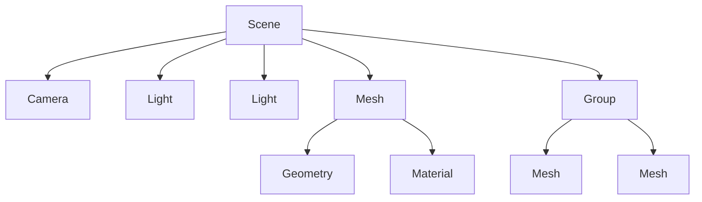

# Technology Deep Dive: Three.js

> Three.js is a JavaScript 3D library that makes WebGL simpler.

---

## 🎯 What is Three.js?

Three.js abstracts WebGL into a higher-level API for creating 3D graphics in the browser. It handles:
- Scene graph management
- Cameras and projections
- Lights and materials
- Geometry creation
- Loaders for external models
- Rendering loop

---

## 🏗️ Core Concepts

### The Scene Graph



### Basic Setup

```javascript
import * as THREE from 'three';

// 1. Scene
const scene = new THREE.Scene();

// 2. Camera
const camera = new THREE.PerspectiveCamera(
  75,                          // FOV (degrees)
  window.innerWidth / window.innerHeight, // Aspect ratio
  0.1,                         // Near clip
  1000                         // Far clip
);
camera.position.z = 5;

// 3. Renderer
const renderer = new THREE.WebGLRenderer({ antialias: true });
renderer.setSize(window.innerWidth, window.innerHeight);
document.body.appendChild(renderer.domElement);

// 4. Object
const geometry = new THREE.BoxGeometry();
const material = new THREE.MeshBasicMaterial({ color: 0x00ff00 });
const cube = new THREE.Mesh(geometry, material);
scene.add(cube);

// 5. Animation loop
function animate() {
  requestAnimationFrame(animate);
  cube.rotation.x += 0.01;
  cube.rotation.y += 0.01;
  renderer.render(scene, camera);
}
animate();
```

---

## 📐 Geometries

### Built-in Geometries

```javascript
// Box
const box = new THREE.BoxGeometry(1, 1, 1);

// Sphere
const sphere = new THREE.SphereGeometry(1, 32, 32);

// Plane
const plane = new THREE.PlaneGeometry(5, 5);

// Cylinder
const cylinder = new THREE.CylinderGeometry(1, 1, 2, 32);

// Torus (donut)
const torus = new THREE.TorusGeometry(1, 0.4, 16, 100);
```

### Parameters

| Geometry | Parameters |
|----------|-----------|
| `BoxGeometry` | width, height, depth |
| `SphereGeometry` | radius, widthSegments, heightSegments |
| `PlaneGeometry` | width, height |
| `CylinderGeometry` | topRadius, bottomRadius, height, segments |

---

## 🎨 Materials

### Basic Materials (Unlit)

```javascript
// Solid color
const material = new THREE.MeshBasicMaterial({ 
  color: 0xff0000 
});

// Wireframe
const wireframe = new THREE.MeshBasicMaterial({ 
  color: 0x00ff00, 
  wireframe: true 
});

// Texture
const texture = new THREE.TextureLoader().load('/texture.jpg');
const textured = new THREE.MeshBasicMaterial({ 
  map: texture 
});
```

### PBR Materials (React to Light)

```javascript
// Standard PBR material
const standard = new THREE.MeshStandardMaterial({
  color: 0xff0000,
  roughness: 0.5,    // 0 = shiny, 1 = matte
  metalness: 0.7,    // 0 = non-metal, 1 = metal
});

// Physical (more realistic)
const physical = new THREE.MeshPhysicalMaterial({
  color: 0xff0000,
  roughness: 0.2,
  metalness: 0.5,
  clearcoat: 1.0,    // Clear coat layer
  clearcoatRoughness: 0.1,
});
```

### Material Properties

| Property | Description |
|----------|-------------|
| `color` | Base color |
| `map` | Texture map |
| `emissive` | Self-illumination color |
| `emissiveIntensity` | Glow strength |
| `transparent` | Enable transparency |
| `opacity` | 0-1 transparency |
| `side` | `FrontSide`, `BackSide`, `DoubleSide` |

---

## 💡 Lights

```javascript
// Ambient - soft base illumination
const ambient = new THREE.AmbientLight(0xffffff, 0.5);
scene.add(ambient);

// Directional - like sun, casts shadows
const directional = new THREE.DirectionalLight(0xffffff, 1);
directional.position.set(5, 5, 5);
directional.castShadow = true;
scene.add(directional);

// Point - emits in all directions from point
const point = new THREE.PointLight(0xff00ff, 1, 100);
point.position.set(0, 2, 0);
scene.add(point);

// Spot - cone of light
const spot = new THREE.SpotLight(0xffffff, 1);
spot.position.set(0, 10, 0);
spot.angle = Math.PI / 6;
spot.penumbra = 0.5;
scene.add(spot);
```

---

## 📷 Cameras

### Perspective Camera (Natural view)

```javascript
const camera = new THREE.PerspectiveCamera(
  75,    // FOV
  aspect,
  0.1,   // Near
  1000   // Far
);
```

### Orthographic Camera (No perspective)

```javascript
const camera = new THREE.OrthographicCamera(
  -5, 5,  // Left, Right
  5, -5,  // Top, Bottom
  0.1,    // Near
  1000    // Far
);
```

---

## 🔄 Transformations

```javascript
// Position
mesh.position.set(x, y, z);
mesh.position.x = 5;

// Rotation (radians)
mesh.rotation.set(x, y, z);
mesh.rotation.y = Math.PI / 4;  // 45 degrees

// Scale
mesh.scale.set(2, 2, 2);

// Look at
mesh.lookAt(targetPosition);
```

---

## 📦 Loading Models

### FBX (This Project)

```javascript
import { FBXLoader } from 'three-stdlib';

const loader = new FBXLoader();
loader.load('/models/crt-monitor.fbx', (object) => {
  // Process loaded object
  object.traverse((child) => {
    if (child.isMesh) {
      child.castShadow = true;
      child.receiveShadow = true;
    }
  });
  
  scene.add(object);
});
```

### GLTF/GLB (Recommended)

```javascript
import { GLTFLoader } from 'three/examples/jsm/loaders/GLTFLoader';

const loader = new GLTFLoader();
loader.load('/models/model.glb', (gltf) => {
  scene.add(gltf.scene);
});
```

---

## 🎭 Textures

```javascript
// Load texture
const textureLoader = new THREE.TextureLoader();
const texture = textureLoader.load('/image.jpg');

// Create material with texture
const material = new THREE.MeshStandardMaterial({
  map: texture,
});

// Canvas texture (dynamic)
const canvas = document.createElement('canvas');
const ctx = canvas.getContext('2d');
// ... draw on canvas
const canvasTexture = new THREE.CanvasTexture(canvas);
```

---

## 🎯 This Project's Usage

### In React Three Fiber

```tsx
import { useFrame, useLoader } from '@react-three/fiber';
import { FBXLoader } from 'three-stdlib';
import * as THREE from 'three';

function Model() {
  const fbx = useLoader(FBXLoader, '/models/crt-monitor.fbx');
  
  // Traverse and modify materials
  useEffect(() => {
    fbx.traverse((child) => {
      if (child.isMesh) {
        child.material = new THREE.MeshStandardMaterial({
          color: child.material.color,
          roughness: 0.4,
          metalness: 0.1,
        });
      }
    });
  }, [fbx]);
  
  return <primitive object={fbx} scale={0.02} />;
}
```

### Screen Glow Effect

```tsx
<mesh position={[0.35, 0.9, 0]}>
  <planeGeometry args={[1.4, 1.0]} />
  <meshStandardMaterial
    color="#00ff41"
    emissive="#00ff41"
    emissiveIntensity={5}
    toneMapped={false}
    transparent
    opacity={0.8}
  />
</mesh>
```

---

## 🔗 Related Documentation

- [[06 - React Three Fiber Setup|React Three Fiber Setup]] — R3F integration
- [[07 - The CRT Monitor Model|The CRT Monitor Model]] — Model loading
- [Three.js Documentation](https://threejs.org/docs/)
- [Three.js Examples](https://threejs.org/examples/)

---

## 📝 Best Practices

1. **Reuse geometries and materials** — Create once, use many
2. **Use appropriate materials** — `MeshBasicMaterial` for unlit, `MeshStandardMaterial` for PBR
3. **Optimize textures** — Power-of-two sizes, compressed formats
4. **Dispose resources** — Call `dispose()` on unused objects
5. **Use instancing** — For many identical objects
