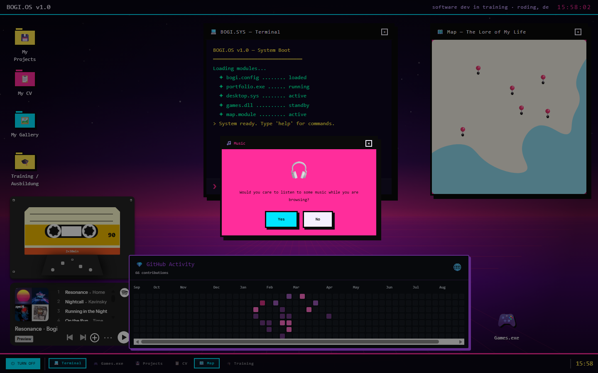
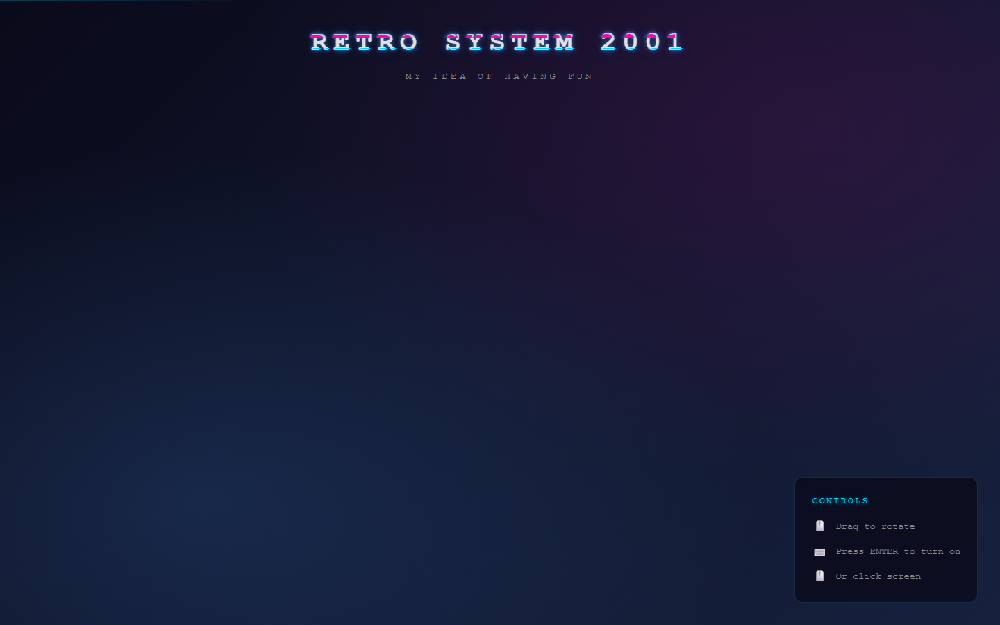

# BOGI.OS

An interactive portfolio built as a small retro operating system. It opens on a 3D CRT computer and leads into a draggable desktop filled with projects, a terminal, music, games, and a few personal details.

[View the live site](https://portfolio-eight-zeta-48.vercel.app)



## About

I wanted the site to feel more like something you can explore than a conventional portfolio page. The result mixes early-web nostalgia, vaporwave colours, and desktop UI patterns with a modern React stack.

Highlights:

- Interactive 3D CRT intro built with React Three Fiber
- Draggable, focus-aware desktop windows
- Project browser and downloadable CV
- Terminal with custom commands
- GitHub activity, music, gallery, map, and games widgets
- Responsive layout with custom CRT and scanline effects

## Screenshots

| Intro | Desktop |
| --- | --- |
|  |  |

## Built with

- Next.js 16 and React 19
- TypeScript
- Three.js and React Three Fiber
- Zustand
- SCSS modules and Tailwind CSS

## Run locally

```bash
git clone https://github.com/BogiSGatze/Portfolio.git
cd Portfolio
npm install
npm run dev
```

Open [http://localhost:3000](http://localhost:3000).

For a production build:

```bash
npm run build
npm start
```

## Project layout

```text
src/
├── app/              # App Router pages
├── components/3d/    # CRT model and Three.js scene
├── components/desktop/
├── hooks/            # Window, terminal, clock, and drag logic
├── store/            # Shared Zustand state
└── styles/           # Desktop and component styles
```

## Contact

Find me on [GitHub](https://github.com/BogiSGatze).
